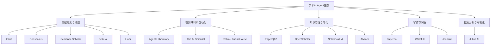

# 学术Agent竞品调研与市场分析

> **调研时间**: 2026-04-15
> **调研目标**: 梳理现有学术Agent生态，识别技术护城河与市场空白，为项目立项提供依据

---

## 一、现有学术Agent全景图

### 1.1 分类体系



---

## 二、重点竞品深度分析

### 2.1 PaperQA2 (FutureHouse)

| 维度 | 内容 |
|:---|:---|
| **GitHub** | [Future-House/paper-qa](https://github.com/Future-House/paper-qa) |
| **定位** | 基于科学文档的高精度 Agentic RAG 系统 |
| **核心能力** | 对本地PDF/文本进行迭代式检索增强生成，自带引用追溯 |
| **技术架构** | Agentic RAG（Agent 可迭代 refine query → retrieve → synthesize） |
| **优势** | ① 引用准确率极高 ② 支持矛盾检测 ③ 学术 benchmark SOTA |
| **不足** | ① 仅处理文本，**不理解论文中的图表/公式** ② 无代码执行能力 ③ 无跨论文知识图谱 |
| **技术护城河** | 独特的 iterative retrieval + citation grounding pipeline |

### 2.2 OpenScholar (AI2 + UW)

| 维度 | 内容 |
|:---|:---|
| **GitHub** | [AkariAsai/OpenScholar](https://github.com/AkariAsai/OpenScholar) |
| **定位** | 基于4500万篇开放获取论文的大规模文献综合模型 |
| **核心能力** | 多论文综合、迭代自反馈检索、高引用准确率 |
| **技术架构** | 大规模 datastore + iterative self-feedback retrieval |
| **优势** | ① 海量文献覆盖 ② 多论文交叉综合能力强 ③ 开源 |
| **不足** | ① **重量级系统，个人难以部署** ② 缺乏交互式使用体验 ③ 无个性化知识积累 |
| **技术护城河** | 45M 论文索引 + Semantic Scholar 生态 |

### 2.3 Agent Laboratory (AMD + JHU)

| 维度 | 内容 |
|:---|:---|
| **GitHub** | [SamuelSchmidgall/AgentLaboratory](https://github.com/SamuelSchmidgall/AgentLaboratory) |
| **定位** | 端到端自动化科研工作流（检索→实验→写报告） |
| **核心能力** | 自动检索 arXiv 文献、设计实验、执行代码、撰写报告、模拟同行评审 |
| **技术架构** | 多 Agent 协作（文献Agent + 实验Agent + 写作Agent） |
| **优势** | ① 全流程覆盖 ② 支持多种 LLM 后端 ③ Human-in-the-loop |
| **不足** | ① **生成内容的原创性和科学贡献度不足**（人类评审指出） ② 自动评分与人工评分差异大 ③ 长任务下状态维护不稳定 |
| **技术护城河** | 完整的文献→代码→报告 pipeline 设计 |

### 2.4 The AI Scientist (Sakana AI)

| 维度 | 内容 |
|:---|:---|
| **定位** | 全自动科学家：从 idea 到论文的完全自主系统 |
| **核心能力** | 自主生成假设、设计实验、执行代码、撰写论文、自我评审 |
| **优势** | ① 最激进的端到端自动化 ② 学术影响力大 |
| **不足** | ① **产出常被评为"sophisticated hallucination"** ② 生成代码的架构质量差 ③ 方向过于激进，实用性待验证 |
| **技术护城河** | 全自主 research loop 的概念验证 |

### 2.5 Elicit

| 维度 | 内容 |
|:---|:---|
| **定位** | 任务驱动的 AI 科研助手，擅长文献综述 |
| **核心能力** | 自然语言查询→结构化证据提取→研究空白识别 |
| **优势** | ① 用户体验优秀 ② 结构化输出 ③ 适合初步调研 |
| **不足** | ① **闭源商业产品，无法定制** ② 无代码执行 ③ 不理解领域特定术语的深层含义 |
| **技术护城河** | 大量用户数据积累 + 产品打磨 |

### 2.6 NotebookLM (Google)

| 维度 | 内容 |
|:---|:---|
| **定位** | 基于个人文档的 AI 笔记本 |
| **核心能力** | 上传文档→问答→综合→播客生成 |
| **优势** | ① Gemini 驱动，免费 ② 多模态内容理解 ③ 播客功能新颖 |
| **不足** | ① **文档数量有限制** ② 不可编程扩展 ③ 无知识图谱 ④ 无代码执行 |
| **技术护城河** | Google 生态 + Gemini 能力 |

---

## 三、技术护城河综合分析

### 3.1 各竞品护城河对比

| 护城河类型 | 代表产品 | 壁垒高度 | 可突破性 |
|:---|:---|:---|:---|
| **海量数据索引** | OpenScholar, Semantic Scholar | ⭐⭐⭐⭐⭐ | 低（需要巨量资源） |
| **RAG 精度优化** | PaperQA2 | ⭐⭐⭐ | 中（开源可学习） |
| **用户体验与生态** | Elicit, NotebookLM | ⭐⭐⭐⭐ | 中（需产品积累） |
| **完整 Pipeline** | Agent Laboratory | ⭐⭐ | 高（架构可复现） |
| **品牌与社区** | Consensus, Scite.ai | ⭐⭐⭐ | 中 |

### 3.2 现有产品的共性不足

> [!IMPORTANT]
> 以下是调研发现的**系统性空白**——这些是你的项目应该重点突破的方向

1. **图表/公式理解缺失**：几乎所有工具只处理论文文本，**忽略图表、公式、算法伪代码**这些论文中最核心的信息载体
2. **领域知识浅薄**：通用工具对"通信感知"、"ISAC"、"信号处理"等深度领域理解有限，无法做到领域级深度推理
3. **知识不可积累**：每次对话都是全新开始，**无法形成个人化的、可增长的知识体系**
4. **代码与论文断裂**：读论文是读论文，跑代码是跑代码，两者之间缺乏桥接
5. **被动响应模式**：所有工具都是"你问我答"，缺乏**主动推送**（如：你关注的领域有新进展、你读过的论文被引用/质疑了）
6. **缺乏学习路径规划**：没有工具能基于你的知识图谱，识别你的知识盲区并规划学习路径

---

## 四、市场机会矩阵

```
                    高技术壁垒
                        ↑
                        |
    OpenScholar    ←    |    → 你的项目？
    PaperQA2            |        (领域深度 + 知识图谱 + 
                        |         多模态 + 代码执行)
                        |
  ──────────────────────┼──────────────────────
                        |
    Elicit              |    → Agent Laboratory
    Consensus           |      The AI Scientist
    NotebookLM          |
                        |
                        ↓
                    低技术壁垒

       通用场景 ←──────────────→ 垂直场景
```

> [!TIP]
> **你的最佳切入象限是「右上」**：结合你通信感知领域的 domain expertise，构建一个技术壁垒高、领域聚焦的学术 Agent。这既是竞品最薄弱的区域，也是你作为博士生最能发挥优势的方向。

---

## 五、对你的项目启示

### 5.1 不应做的事

- ❌ 不要做又一个通用文献搜索工具（Elicit、Consensus 已经很成熟）
- ❌ 不要做又一个"全自动写论文"系统（Agent Laboratory 已覆盖，且学术界对此持谨慎态度）
- ❌ 不要做纯 Chatbot 形态的论文问答（NotebookLM 免费且体验好）

### 5.2 应该做的事

- ✅ 做一个**能读懂论文中图表和公式**的 Agent（多模态理解）
- ✅ 做一个**领域知识可积累、可增长**的 Agent（知识图谱）
- ✅ 做一个**论文理解与代码验证一体化**的 Agent（代码执行）
- ✅ 做一个**主动感知领域动态**的 Agent（而非被动问答）
- ✅ 做一个**能辅助规划学习路径**的 Agent（基于知识盲区检测）
