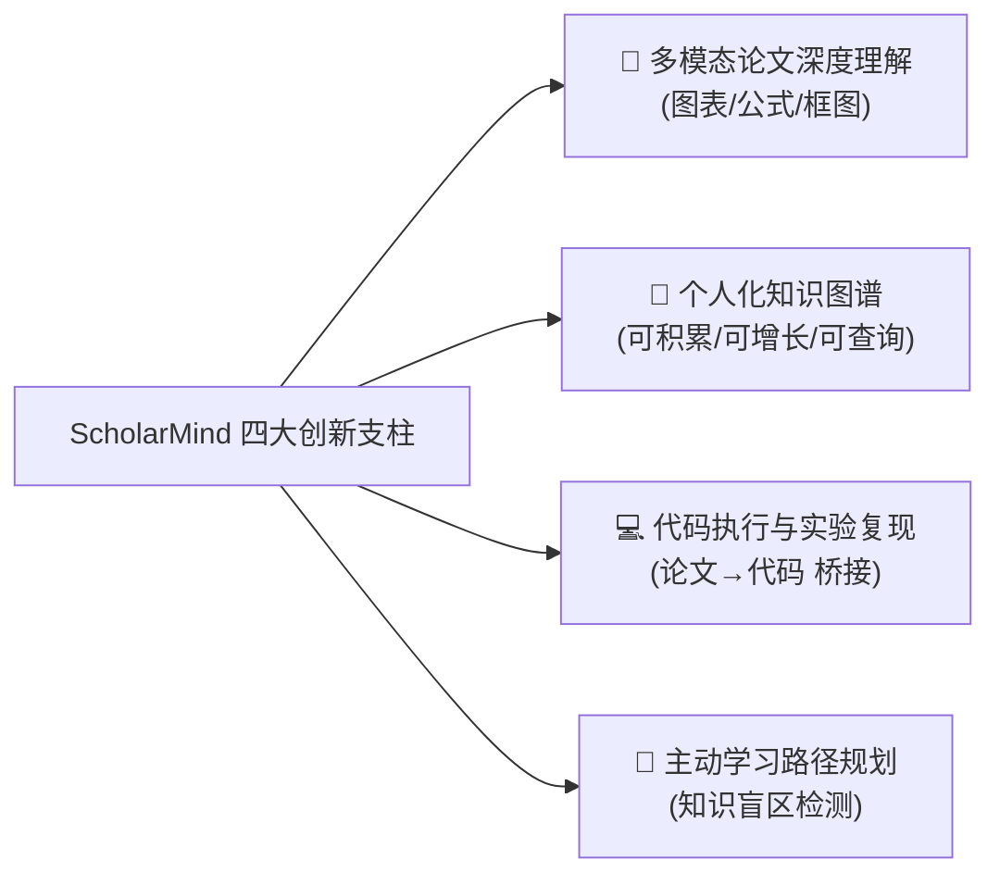
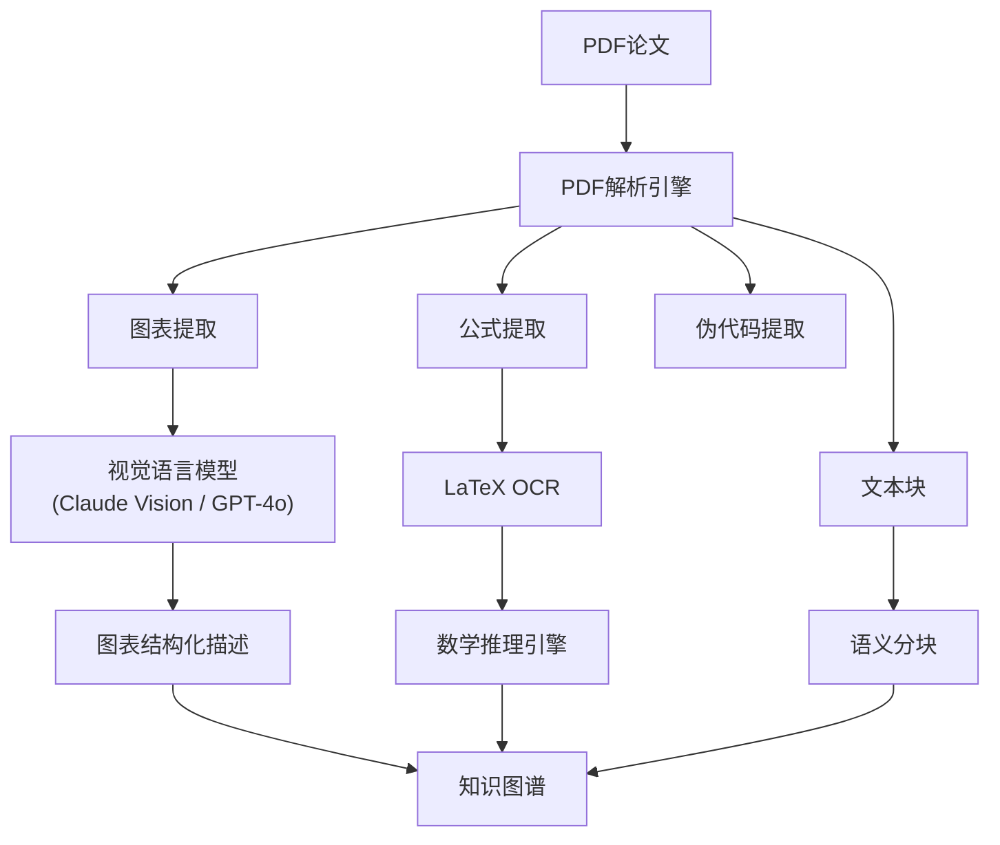
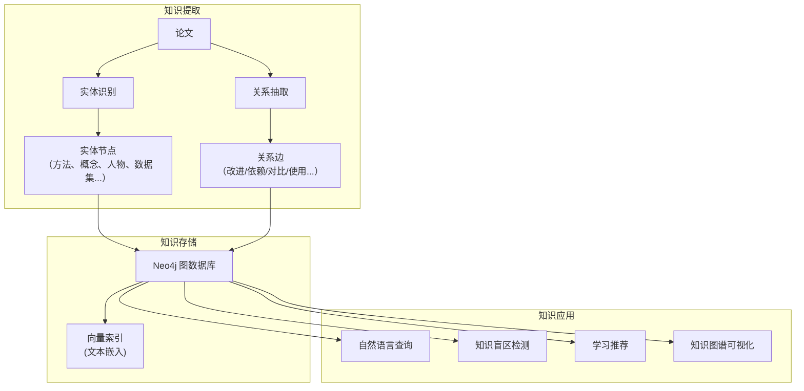
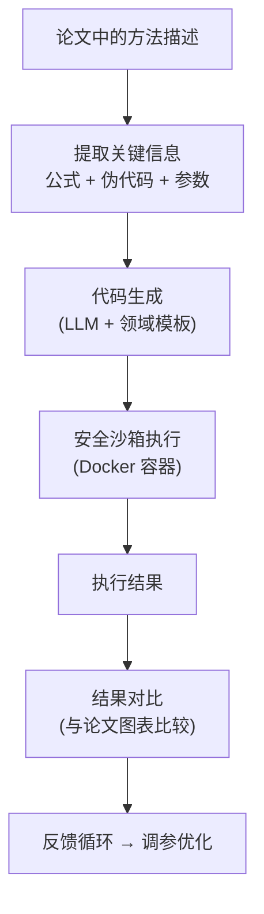
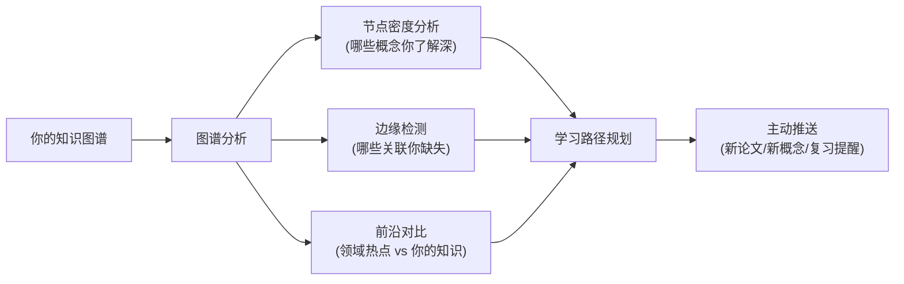

# 项目设计与创新点规划

> **项目代号**: ScholarMind（学者之脑）
> **一句话定位**: 面向通信感知领域的多模态学术研究 Agent——能读懂你的论文图表、帮你构建知识图谱、复现实验代码、并规划你的学习路径。

---

## 一、项目核心定位

### 1.1 你的独特身份优势

> [!IMPORTANT]
> 你不是在做一个"通用 AI 工具"，你是在做一个**领域专家的 AI 副驾驶**。你的通信感知/ISAC 博士背景就是最大的差异化壁垒。

| 你的优势 | 如何体现在项目中 |
|:---|:---|
| 通信感知领域知识 | 预置领域知识体系、理解 ISAC/6G 专业术语 |
| 论文阅读经验 | 知道硕博生读论文的真实痛点在哪里 |
| 实验复现经历 | 理解代码与论文之间的 gap 有多大 |
| 数学/信号处理背景 | 能设计公式理解与推导辅助功能 |

### 1.2 项目定位差异化



---

## 二、四大创新支柱详解

### 2.1 支柱一：多模态论文深度理解

#### 核心问题
现有工具（PaperQA2、Elicit等）几乎只处理论文的**纯文本**，但对于通信感知领域：
- **系统框图**（如 OFDM 收发机结构图）承载了方法论的核心
- **仿真结果图**（如 BER vs SNR 曲线）是论文的关键结论
- **数学公式**（如信道模型、CRLB 推导）是理论贡献的精髓
- **算法伪代码**是实现细节的关键

#### 技术方案



#### 技术选型与可行性

| 模块 | 推荐方案 | 可行性 | 备注 |
|:---|:---|:---|:---|
| PDF 解析 | PyMuPDF / pdfplumber | ⭐⭐⭐⭐⭐ | 成熟工具 |
| 图表提取 | PyMuPDF 图片提取 + 布局分析 | ⭐⭐⭐⭐ | 可直接使用 |
| 图表理解 | Claude Vision API（多模态）| ⭐⭐⭐⭐ | Claude 的图表理解能力已经很强 |
| 公式 OCR | Mathpix / Nougat (Meta开源) | ⭐⭐⭐⭐ | Nougat 免费且准确 |
| 公式推理 | LLM + SymPy 符号计算 | ⭐⭐⭐ | LLM 数学能力在增强中 |

> [!TIP]
> **MVP 策略**：先用 Claude Vision 直接理解整页 PDF 截图（含图表），效果已经很好。后续再精细化实现图表单独提取 + 结构化分析。

#### 技术壁垒评估
- **壁垒中等**：视觉理解依赖大模型 API，但**领域特定的 prompt 设计**（如何让模型正确理解 OFDM 框图、信道估计流程图）是你的核心壁垒
- **你的优势**：通用模型可能把 BER 曲线理解为"折线图"，但你可以设计 prompt 让它理解"这是一条BER vs SNR 曲线，拐点处对应编码增益约 3dB"

---

### 2.2 支柱二：个人化知识图谱

#### 核心问题
现有工具每次对话都是"无状态"的。而硕博生的学术学习是一个**持续积累**的过程：
- 你读过的论文应该能形成关联网络
- 你理解的概念应该能自动链接
- 你的知识盲区应该能被识别出来

#### 技术方案



#### 知识图谱 Schema 设计（通信感知领域定制）

```
节点类型 (Node Types):
├── Paper          (论文: title, year, venue, abstract)
├── Author         (作者: name, affiliation)
├── Concept        (概念: name, definition, domain)
│   ├── ISAC, OFDM, MIMO, Beamforming, Channel Estimation...
├── Method         (方法: name, category, complexity)
│   ├── MUSIC, ESPRIT, Compressed Sensing, Deep Learning...
├── Dataset        (数据集: name, description, link)
├── Metric         (评估指标: name, formula)
│   ├── BER, CRLB, RMSE, Spectral Efficiency...
└── Tool           (工具: name, language, link)
    ├── MATLAB, Python, ns-3...

关系类型 (Relationship Types):
├── PROPOSES       (Paper → Method)
├── USES           (Paper → Concept/Method/Dataset/Tool)
├── IMPROVES       (Method → Method)
├── COMPARES_WITH  (Paper → Paper)
├── AUTHORED_BY    (Paper → Author)
├── EVALUATED_BY   (Method → Metric)
└── BELONGS_TO     (Concept → Concept)  // 层级关系
```

#### 技术选型与可行性

| 模块 | 推荐方案 | 可行性 | 备注 |
|:---|:---|:---|:---|
| 图数据库 | Neo4j Community (免费) | ⭐⭐⭐⭐⭐ | 最成熟的图数据库 |
| 向量数据库 | ChromaDB (轻量嵌入式) | ⭐⭐⭐⭐⭐ | 无需部署服务器 |
| 实体/关系抽取 | LLM (Claude) + Schema-guided | ⭐⭐⭐⭐ | 用 structured output |
| 图查询 | LLM → Cypher 查询 | ⭐⭐⭐⭐ | LangChain 有成熟方案 |
| 可视化 | D3.js / vis-network | ⭐⭐⭐⭐ | 前端可视化 |

> [!NOTE]
> **轻量替代方案**：如果你不想一开始就上 Neo4j，可以先用 **NetworkX (Python) + JSON 文件存储**。功能上先跑通，后期再迁移到 Neo4j。

#### 技术壁垒评估
- **壁垒中等偏高**：知识图谱的难点在于**Schema 设计**和**抽取质量**
- **你的优势**：你的通信感知 domain knowledge 让你可以设计出精准的 Schema——这是通用工具做不到的

---

### 2.3 支柱三：代码执行与实验复现

#### 核心问题
硕博生读完论文后最大的痛点之一是：**如何把论文中的方法变成代码？**
- 论文里的公式省略了很多实现细节
- 伪代码到可运行代码之间有巨大 gap
- 参数设置、数据预处理往往一笔带过

#### 技术方案



#### 关键设计

**代码模板体系**：为通信感知领域预置常用模板
```python
# 示例：信道估计模板
templates = {
    "ls_channel_estimation": "...",     # 最小二乘信道估计
    "mmse_channel_estimation": "...",   # MMSE信道估计  
    "ofdm_system": "...",              # OFDM系统仿真
    "ber_simulation": "...",           # BER仿真框架
    "doa_estimation": "...",           # DOA估计（MUSIC/ESPRIT）
    "beamforming": "...",              # 波束成形
}
```

**安全沙箱**：使用 Docker 容器隔离代码执行
```
执行环境:
├── Python 3.11+
├── numpy, scipy, matplotlib (科学计算标配)
├── sionna (5G/6G仿真库, by Nvidia)
├── commpy (通信系统仿真)
└── 网络隔离 + 资源限制 (CPU/内存/时间)
```

#### 技术选型与可行性

| 模块 | 推荐方案 | 可行性 | 备注 |
|:---|:---|:---|:---|
| 代码生成 | Claude + 领域 prompt template | ⭐⭐⭐⭐ | Claude 代码能力强 |
| 沙箱执行 | Docker + subprocess | ⭐⭐⭐⭐ | 成熟方案 |
| 轻量替代 | RestrictedPython / subprocess | ⭐⭐⭐ | MVP 阶段可用 |
| 结果对比 | matplotlib + VLM 比对 | ⭐⭐⭐ | 创新点！ |

> [!WARNING]
> **代码执行是整个项目中技术壁垒最高的部分**，但也是面试中最能展示系统能力的部分。建议作为第二阶段实现。

#### 技术壁垒评估
- **壁垒高**：安全沙箱、错误恢复、结果可视化都需要扎实的工程能力
- **你的优势**：你知道通信仿真代码（MATLAB/Python）的典型结构，可以设计高质量的代码模板

---

### 2.4 支柱四：主动学习路径规划

#### 核心问题
没有工具能告诉你：
- "你读了 10 篇 ISAC 论文，但对 mutual information 理论基础缺乏了解"
- "根据你的研究方向，建议你接下来了解 RIS-aided sensing"
- "你关注领域有 3 篇新论文值得阅读"

#### 技术方案



#### 可行性
- **壁垒低→中**：基于知识图谱的分析相对简单（图算法 + LLM 总结）
- **但用户价值极高**：这是最打动硕博生用户的功能
- **实现依赖**：需要支柱二（知识图谱）先完成

---

## 三、创新点总结

### 3.1 对比表：你的项目 vs 现有工具

| 功能维度 | PaperQA2 | Elicit | Agent Lab | NotebookLM | **ScholarMind** |
|:---|:---:|:---:|:---:|:---:|:---:|
| 论文文本理解 | ✅ | ✅ | ✅ | ✅ | ✅ |
| **图表/公式理解** | ❌ | ❌ | ❌ | 部分 | **✅** |
| **个人知识图谱** | ❌ | ❌ | ❌ | ❌ | **✅** |
| **代码执行/复现** | ❌ | ❌ | ✅ | ❌ | **✅** |
| **知识盲区检测** | ❌ | ❌ | ❌ | ❌ | **✅** |
| **领域深度定制** | ❌ | ❌ | ❌ | ❌ | **✅** |
| 多论文交叉分析 | ✅ | ✅ | ❌ | 部分 | ✅ |
| 主动推送 | ❌ | ❌ | ❌ | ❌ | **✅** |

### 3.2 简历亮点提炼

> **面试中如何表述这个项目**

用一句话：
> "我构建了一个面向通信感知领域的多模态学术 Agent，它能理解论文中的图表和公式、自动构建个人知识图谱、在沙箱中复现实验代码，并基于知识盲区检测来规划学习路径。"

```
技术栈关键词（面试亮点）:
├── Claude API / MCP (Model Context Protocol)
├── Agentic RAG (迭代式检索增强生成)
├── 多模态理解 (Vision Language Model)
├── GraphRAG (知识图谱 + LLM)
├── Neo4j / Cypher (图数据库)
├── 安全沙箱 (Docker-based code execution)
├── MCP Server 开发 (Python SDK)
├── 评测体系 (幻觉检测 / 引用准确率)
└── 领域知识工程 (通信感知 ontology)
```

---

## 四、MVP 设计：最小可行产品

> [!IMPORTANT]
> 不要试图一次做完所有功能。以下是分阶段的 MVP 策略。

### Phase 0: 基石（1周）
- Claude Code + CLAUDE.md 配置
- 开发第一个 MCP Server（论文搜索工具）
- 基本的论文 PDF 解析

### Phase 1: 多模态论文理解（2-3周）
- PDF 截图 + Claude Vision 理解图表
- 公式 OCR + LaTeX 解析
- 结构化论文笔记生成

### Phase 2: 知识图谱（2-3周）
- 实体/关系抽取 pipeline
- NetworkX 本地知识图谱（轻量版）
- 自然语言查询知识图谱
- 简单的知识可视化

### Phase 3: 代码执行（2-3周）
- Docker 沙箱搭建
- 领域代码模板库
- 论文→代码自动生成
- 执行结果可视化

### Phase 4: 学习规划（1-2周）
- 知识盲区检测算法
- 学习路径推荐
- 新论文推送

### Phase 5: 工程化（持续）
- 评测体系建设
- 性能与成本优化
- README + 架构文档完善
