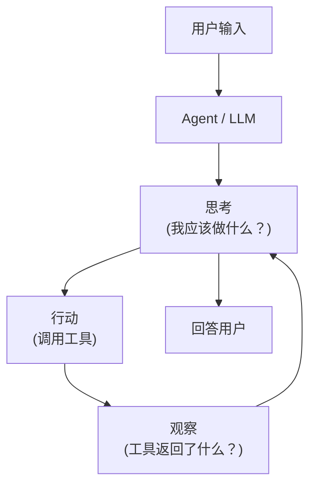
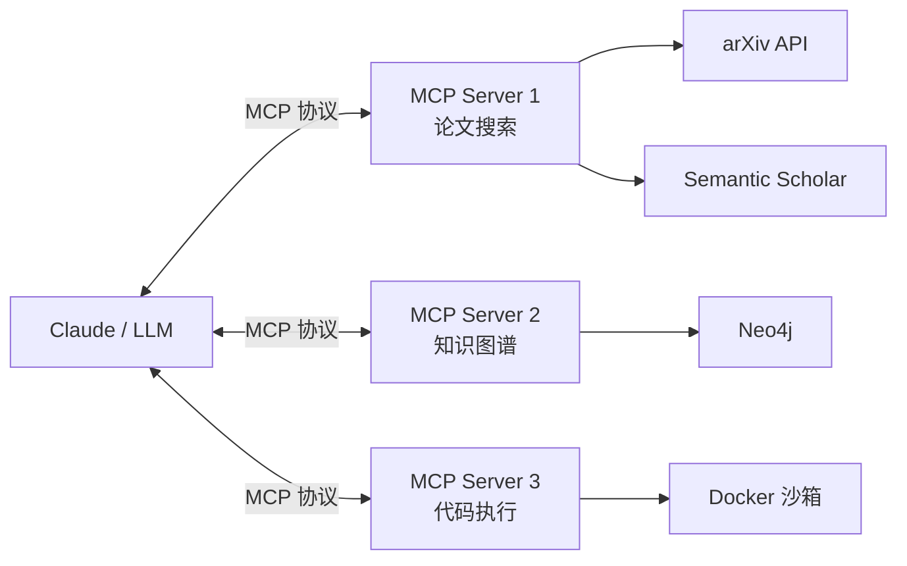
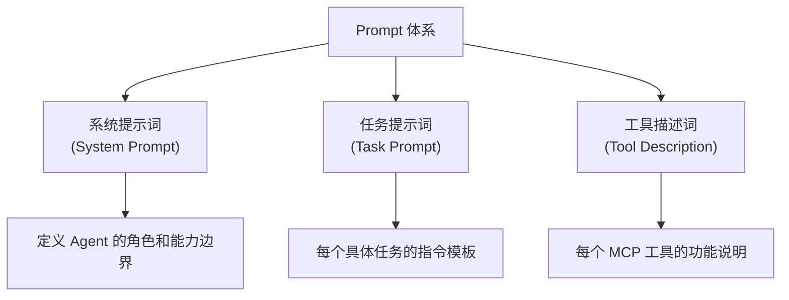

# 从零开始的Agent开发完全指南

> **适用对象**: Agent 和 LLM 应用开发的完全初学者
> **目标**: 从 0 到 1 搭建 ScholarMind 学术 Agent
> **技术栈**: Python + Claude API + MCP + Claude Code

---

## 一、你需要先理解的核心概念

### 1.1 什么是 Agent？

> [!NOTE]
> 一句话：Agent = LLM + 工具调用 + 规划循环



**关键区别**：
| | ChatBot | Agent |
|:---|:---|:---|
| 核心 | LLM 直接回答 | LLM 决策 + 工具执行 |
| 能力边界 | 仅限 LLM 内部知识 | 可调用外部工具/API/数据库 |
| 工作模式 | 单轮问答 | 多步推理循环 |
| 输出 | 文本 | 文本 + 行动（搜索、执行代码、写文件...） |

### 1.2 ReAct 模式（核心范式）

Agent 最基本的工作模式是 **ReAct (Reasoning + Acting)**:

```
Input: "帮我找3篇关于 ISAC 信道估计的论文并总结"

Agent 思考（Reason）: 
  用户想要 ISAC 信道估计相关论文。我需要先搜索论文。

Agent 行动（Act）: 
  调用工具 → search_papers("ISAC channel estimation")

Agent 观察（Observe）:
  工具返回了 10 篇论文的标题和摘要...

Agent 思考（Reason）:
  我得到了 10 篇论文。让我筛选最相关的 3 篇并总结。

Agent 行动（Act）:
  调用工具 → get_paper_details(paper_id_1)
  调用工具 → get_paper_details(paper_id_2)  
  调用工具 → get_paper_details(paper_id_3)

Agent 观察（Observe）:
  获得了 3 篇论文的完整信息...

Agent 回答:
  "以下是 3 篇关于 ISAC 信道估计的重要论文：..."
```

### 1.3 什么是 MCP（Model Context Protocol）？

> [!NOTE]
> MCP 是 Anthropic 推出的开放协议，让 LLM 以标准化方式调用外部工具。可以理解为"Agent 的 USB 接口"。



**关键概念**：
- **MCP Server**: 你写的 Python 程序，暴露工具给 Claude
- **Tool**: 一个具体的功能函数，如 `search_papers()`, `add_to_knowledge_graph()`
- **Resource**: 提供数据/上下文给 Claude（如知识图谱的当前状态）
- **Transport**: 通信方式（本地用 stdio，远程用 SSE/HTTP）

### 1.4 什么是 RAG？

**RAG (Retrieval-Augmented Generation)** = 检索增强生成

```
传统 LLM:  用户问题 → LLM → 答案（可能幻觉）

RAG:       用户问题 → 检索相关文档 → 文档 + 问题一起给 LLM → 有据可查的答案
```

**你的项目中的 RAG**:
- 用户问："ISAC 中 sensing 信号的设计准则是什么？"
- Agent 先从你的知识图谱/论文库中检索相关段落
- 然后基于检索结果生成回答（附引用来源）

---

## 二、开发环境搭建

### 2.1 前置要求


```
必需软件:
├── Python 3.11+     (你的主要开发语言)
├── Node.js 18+      (Claude Code 运行环境)
├── Git              (版本控制)
├── Docker Desktop   (代码沙箱，Phase 3 需要)
└── VS Code          (IDE，已有)

需要的账号/API:
├── Anthropic API Key (Claude API，核心)
│   └── 申请: https://console.anthropic.com/
│   └── 建议: 先用 Claude Sonnet, 成本低
├── Semantic Scholar API Key (论文搜索，免费)
│   └── 申请: https://www.semanticscholar.org/product/api
└── GitHub 账号 (代码托管，已有)
```

### 2.2 环境安装步骤

#### Step 1: Python 环境

```powershell
# 建议使用 conda 创建独立环境（你已有 conda）
conda create -n scholarmind python=3.11 -y
conda activate scholarmind

# 安装核心依赖
pip install anthropic           # Anthropic Python SDK
pip install "mcp[cli]"          # MCP Python SDK (含 FastMCP)
pip install pymupdf             # PDF 解析
pip install chromadb            # 向量数据库
pip install networkx            # 轻量图数据库（Phase 2）
pip install httpx               # 异步 HTTP 客户端
pip install rich                # 美化终端输出
```

#### Step 2: Claude Code 安装

```powershell
# 安装 Claude Code (全局)
npm install -g @anthropic-ai/claude-code

# 设置 API Key (Windows PowerShell)
$env:ANTHROPIC_API_KEY = "sk-ant-api03-你的key"

# 验证安装
claude --version
```

#### Step 3: 项目初始化

```powershell
# 进入项目目录
cd e:\Materials\AntiG\AcademicAgent

# 初始化 Git
git init
git remote add origin https://github.com/Jennyee1/AcademicAgent.git

# 创建项目结构
mkdir src
mkdir src\mcp_servers
mkdir src\core
mkdir src\knowledge
mkdir src\execution
mkdir tests
mkdir docs
mkdir prompts
mkdir templates
```

#### Step 4: 项目目录结构

```
AcademicAgent/
├── CLAUDE.md                    # Claude Code 的项目指令文件（重要！）
├── README.md                    # 项目说明
├── requirements.txt             # Python 依赖
├── .env                         # API Keys（不要提交到 Git！）
├── .gitignore                   # Git 忽略文件
│
├── src/
│   ├── mcp_servers/             # MCP Server 实现目录
│   │   ├── paper_search.py      # 论文搜索 MCP Server
│   │   ├── knowledge_graph.py   # 知识图谱 MCP Server
│   │   └── code_executor.py     # 代码执行 MCP Server
│   │
│   ├── core/                    # 核心模块
│   │   ├── pdf_parser.py        # PDF 解析与图表提取
│   │   ├── multimodal.py        # 多模态理解（图表/公式）
│   │   └── rag_pipeline.py      # RAG 检索管线
│   │
│   ├── knowledge/               # 知识图谱模块
│   │   ├── schema.py            # 图谱 Schema 定义
│   │   ├── extractor.py         # 实体/关系抽取
│   │   ├── graph_store.py       # 图谱存储（NetworkX/Neo4j）
│   │   └── query_engine.py      # 自然语言查询引擎
│   │
│   └── execution/               # 代码执行模块
│       ├── sandbox.py           # 安全沙箱
│       ├── code_generator.py    # 代码生成器
│       └── result_analyzer.py   # 结果分析器
│
├── prompts/                     # Prompt 模板库
│   ├── system_prompts/          # 系统提示词
│   ├── extraction_prompts/      # 知识抽取提示词
│   └── domain_prompts/          # 领域特定提示词
│
├── templates/                   # 领域代码模板
│   ├── ofdm_system.py           
│   ├── channel_estimation.py    
│   └── ber_simulation.py        
│
├── tests/                       # 测试目录
│   ├── test_paper_search.py
│   ├── test_knowledge_graph.py
│   └── test_code_executor.py
│
└── docs/                        # 文档
    ├── architecture.md          # 架构文档
    └── evaluation.md            # 评测报告
```

### 2.3 创建 `.env` 文件

```bash
# .env 文件内容
ANTHROPIC_API_KEY=sk-ant-api03-你的key
SEMANTIC_SCHOLAR_API_KEY=你的key
```

### 2.4 创建 `.gitignore`

```
.env
__pycache__/
*.pyc
.venv/
data/
*.pdf
node_modules/
.claude/
```

---

## 三、CLAUDE.md 配置（极其重要）

> [!IMPORTANT]
> `CLAUDE.md` 是 Claude Code 的"项目大脑"。Claude 在你的项目目录中工作时，会自动读取这个文件作为持久化指令。这是你定制 Agent 行为最关键的文件。

在项目根目录创建 `CLAUDE.md`:

```markdown
# ScholarMind - 学术研究Agent

## 项目概述
ScholarMind 是面向通信感知（ISAC/6G）领域的多模态学术Agent。
核心能力：论文图表理解、知识图谱构建、代码执行与实验复现。

## 角色定义
你是一名通信感知领域的高级学术研究助手。你的用户是该领域的硕博研究生。
你需要：
- 深入理解论文中的信号处理、通信理论和感知算法
- 能识别论文中的核心贡献、方法创新点和实验设置
- 理解 OFDM、MIMO、波束成形、信道估计等核心概念
- 在回答中提供精确的数学表达和物理直觉

## 领域术语表
- ISAC = Integrated Sensing and Communication 通感一体化
- OFDM = Orthogonal Frequency Division Multiplexing 正交频分复用
- MIMO = Multiple-Input Multiple-Output 多输入多输出
- CRLB = Cramér-Rao Lower Bound 克拉美罗下界
- DOA = Direction of Arrival 到达方向
- RIS = Reconfigurable Intelligent Surface 可重构智能超表面
- BER = Bit Error Rate 误比特率

## 工作流程
1. 当用户上传论文时，先提取全文结构（标题、摘要、方法、实验、结论）
2. 对论文中的图表使用视觉理解能力进行分析
3. 将论文中的关键信息提取为知识图谱节点和关系
4. 如果用户要求代码复现，使用领域模板生成可执行代码

## 代码规范
- Python 代码遵循 PEP 8
- 使用 type hints
- 每个函数需要 docstring
- 科学计算优先使用 numpy/scipy
```

---

## 四、你的第一个 MCP Server：论文搜索

> [!TIP]
> 这是你整个项目的"Hello World"。从这里开始建立信心。

### 4.1 完整代码实现

创建 `src/mcp_servers/paper_search.py`:

```python
"""
ScholarMind - 论文搜索 MCP Server
使用 Semantic Scholar API 搜索和获取学术论文

这是你的第一个 MCP Server！
功能：
1. search_papers: 搜索论文
2. get_paper_details: 获取论文详细信息
3. get_paper_citations: 获取引用关系
"""

import httpx
import json
from mcp.server.fastmcp import FastMCP

# ========== 初始化 MCP Server ==========
mcp = FastMCP(
    "ScholarMind-PaperSearch",
    description="学术论文搜索与检索服务，基于 Semantic Scholar API"
)

# ========== 配置 ==========
SEMANTIC_SCHOLAR_BASE = "https://api.semanticscholar.org/graph/v1"
# 如果有 API Key，可以提高请求限额
API_KEY = None  # 后续从 .env 读取


async def _make_request(url: str, params: dict = None) -> dict:
    """统一的 HTTP 请求函数，带错误处理"""
    headers = {}
    if API_KEY:
        headers["x-api-key"] = API_KEY
    
    async with httpx.AsyncClient(timeout=30.0) as client:
        response = await client.get(url, params=params, headers=headers)
        response.raise_for_status()
        return response.json()


# ========== 工具定义 ==========

@mcp.tool()
async def search_papers(
    query: str,
    limit: int = 5,
    year_range: str = None,
    fields_of_study: str = None,
) -> str:
    """
    搜索学术论文。适合在用户想要查找特定主题的论文时使用。
    
    Args:
        query: 搜索查询词，例如 "ISAC channel estimation" 或 "RIS aided sensing"
        limit: 返回结果数量，默认5篇，最多10篇
        year_range: 年份范围，格式如 "2020-2025"
        fields_of_study: 学科过滤，如 "Computer Science" 或 "Engineering"
    
    Returns:
        包含论文标题、作者、年份、引用数和摘要的格式化结果
    """
    url = f"{SEMANTIC_SCHOLAR_BASE}/paper/search"
    params = {
        "query": query,
        "limit": min(limit, 10),
        "fields": "title,authors,year,citationCount,abstract,url,venue",
    }
    
    if year_range:
        params["year"] = year_range
    if fields_of_study:
        params["fieldsOfStudy"] = fields_of_study
    
    try:
        data = await _make_request(url, params)
        papers = data.get("data", [])
        
        if not papers:
            return "未找到相关论文。请尝试调整搜索关键词。"
        
        results = []
        for i, paper in enumerate(papers, 1):
            authors = ", ".join(
                [a.get("name", "Unknown") for a in paper.get("authors", [])[:3]]
            )
            if len(paper.get("authors", [])) > 3:
                authors += " et al."
            
            result = (
                f"### [{i}] {paper.get('title', 'N/A')}\n"
                f"- **作者**: {authors}\n"
                f"- **年份**: {paper.get('year', 'N/A')}\n"
                f"- **发表于**: {paper.get('venue', 'N/A')}\n"
                f"- **引用数**: {paper.get('citationCount', 0)}\n"
                f"- **Paper ID**: {paper.get('paperId', 'N/A')}\n"
                f"- **摘要**: {paper.get('abstract', '无摘要')[:300]}..."
            )
            results.append(result)
        
        return f"## 搜索结果: \"{query}\"\n\n" + "\n\n---\n\n".join(results)
    
    except httpx.HTTPError as e:
        return f"搜索出错: {str(e)}"


@mcp.tool()
async def get_paper_details(paper_id: str) -> str:
    """
    获取论文的完整详细信息，包括摘要、引用关系和外部链接。
    适合在用户想要深入了解某篇特定论文时使用。
    
    Args:
        paper_id: Semantic Scholar 的论文 ID（从 search_papers 结果中获取）
    
    Returns:
        论文的完整信息，包括摘要、引用统计和相关链接
    """
    url = f"{SEMANTIC_SCHOLAR_BASE}/paper/{paper_id}"
    params = {
        "fields": (
            "title,authors,year,abstract,citationCount,referenceCount,"
            "url,venue,publicationDate,fieldsOfStudy,tldr,"
            "openAccessPdf,externalIds"
        )
    }
    
    try:
        paper = await _make_request(url, params)
        
        authors = ", ".join(
            [a.get("name", "Unknown") for a in paper.get("authors", [])]
        )
        
        tldr = paper.get("tldr", {})
        tldr_text = tldr.get("text", "无自动摘要") if tldr else "无自动摘要"
        
        pdf_info = paper.get("openAccessPdf", {})
        pdf_url = pdf_info.get("url", "无公开PDF") if pdf_info else "无公开PDF"
        
        external_ids = paper.get("externalIds", {})
        doi = external_ids.get("DOI", "N/A") if external_ids else "N/A"
        arxiv_id = external_ids.get("ArXiv", "N/A") if external_ids else "N/A"
        
        result = (
            f"## {paper.get('title', 'N/A')}\n\n"
            f"- **作者**: {authors}\n"
            f"- **年份**: {paper.get('year', 'N/A')}\n"
            f"- **发表于**: {paper.get('venue', 'N/A')}\n"
            f"- **发表日期**: {paper.get('publicationDate', 'N/A')}\n"
            f"- **引用数**: {paper.get('citationCount', 0)}\n"
            f"- **参考文献数**: {paper.get('referenceCount', 0)}\n"
            f"- **研究领域**: {', '.join(paper.get('fieldsOfStudy', ['N/A']))}\n"
            f"- **DOI**: {doi}\n"
            f"- **ArXiv ID**: {arxiv_id}\n"
            f"- **PDF链接**: {pdf_url}\n\n"
            f"### TL;DR\n{tldr_text}\n\n"
            f"### 摘要\n{paper.get('abstract', '无摘要')}"
        )
        
        return result
    
    except httpx.HTTPError as e:
        return f"获取论文详情出错: {str(e)}"


@mcp.tool()
async def get_related_papers(paper_id: str, limit: int = 5) -> str:
    """
    获取与指定论文相关的推荐论文。
    适合在用户想要扩展阅读时使用。
    
    Args:
        paper_id: 源论文的 Semantic Scholar ID
        limit: 返回相关论文数量，默认5篇
    
    Returns:
        与源论文相关的论文列表
    """
    url = f"{SEMANTIC_SCHOLAR_BASE}/paper/{paper_id}/references"
    params = {
        "fields": "title,authors,year,citationCount,abstract",
        "limit": min(limit, 10),
    }
    
    try:
        data = await _make_request(url, params)
        references = data.get("data", [])
        
        if not references:
            return "未找到相关引用论文。"
        
        results = []
        for i, ref in enumerate(references, 1):
            paper = ref.get("citedPaper", {})
            authors = ", ".join(
                [a.get("name", "Unknown") for a in paper.get("authors", [])[:3]]
            )
            
            result = (
                f"**[{i}]** {paper.get('title', 'N/A')} "
                f"({paper.get('year', 'N/A')}) - "
                f"引用数: {paper.get('citationCount', 0)}\n"
                f"   作者: {authors}"
            )
            results.append(result)
        
        return "## 相关参考文献\n\n" + "\n\n".join(results)
    
    except httpx.HTTPError as e:
        return f"获取相关论文出错: {str(e)}"


# ========== 启动服务器 ==========
if __name__ == "__main__":
    mcp.run()
```

### 4.2 测试你的 MCP Server

```powershell
# 方法1: 使用 MCP Inspector（交互式测试）
mcp dev src/mcp_servers/paper_search.py

# 方法2: 注册到 Claude Code
claude mcp add paper-search python src/mcp_servers/paper_search.py

# 方法3: 直接在 Claude Code 中使用
claude
# 然后在 Claude Code 中说: "搜索关于 ISAC channel estimation 的论文"
```

### 4.3 注意事项

> [!WARNING]
> **初学者常见踩坑点：**
> 1. **MCP Server 必须是独立进程**——它是作为子进程被 Claude Code 启动的，不是 import 进来的
> 2. **工具的 docstring 至关重要**——Claude 通过 docstring 理解什么时候该调用你的工具
> 3. **参数类型必须明确**——使用 Python type hints，MCP SDK 会自动生成 JSON Schema
> 4. **错误处理要友好**——返回给 Claude 的错误信息要是人类可读的，Claude 会据此调整策略

---

## 五、Prompt Engineering 指南

### 5.1 三类 Prompt 及其写法

在你的 Agent 项目中，需要设计三类 Prompt：



### 5.2 系统提示词 (System Prompt) 写法

```markdown
# 系统提示词模板

你是 ScholarMind，一名通信感知（ISAC/6G）领域的高级学术研究助手。

## 你的核心能力
1. 论文检索与深度分析（包括图表和公式理解）
2. 学术知识图谱构建与查询
3. 代码生成与实验复现
4. 学习路径规划

## 行为准则
- 所有观点必须有论文支撑，拒绝无来源的断言
- 数学公式使用 LaTeX 格式
- 代码默认使用 Python，科学计算使用 numpy/scipy
- 使用中文回答，但专业术语保留英文

## 严格禁止
- 不要编造不存在的论文引用
- 不要给出没有论文依据的技术结论
- 不要代替用户做出研究方向的决定

## 输出格式偏好
- 论文分析输出结构化笔记
- 代码输出包含注释和使用说明
- 知识图谱更新输出变更记录
```

### 5.3 任务提示词 (Task Prompt) 示例

#### 论文分析模板
```markdown
# 论文深度分析任务

## 输入
论文 PDF 或文本内容

## 分析维度
请按以下结构进行分析：

### 1. 基本信息
- 标题、作者、发表年份和期刊

### 2. 研究问题
- 这篇论文要解决什么问题？
- 为什么这个问题重要？

### 3. 核心方法
- 提出了什么方法？
- 关键假设是什么？
- 核心公式/算法是什么？（用 LaTeX 写出）

### 4. 实验设置
- 仿真/实验参数设置
- 对比基线方法
- 评价指标

### 5. 主要结论
- 核心发现是什么？
- 性能提升了多少？（给出具体数值）

### 6. 局限性与未来工作
- 作者承认的局限性
- 你认为还有哪些可改进之处？

### 7. 知识图谱节点
- 列出可提取的实体（概念、方法、数据集、指标）
- 列出实体之间的关系
```

#### 知识抽取模板
```markdown
# 知识三元组抽取任务

## 输入
论文的方法部分文本

## 输出要求
提取 JSON 格式的三元组列表：

```json
{
  "entities": [
    {"name": "xxx", "type": "Method/Concept/Metric/Dataset", "description": "..."},
  ],
  "relations": [
    {"source": "xxx", "target": "yyy", "relation": "PROPOSES/USES/IMPROVES/..."},
  ]
}
```

## 抽取规则
1. 实体名称使用论文中的原文（英文）
2. 每个实体必须有 type 标注
3. 关系类型限定为预定义的集合
4. 忽略过于通用的概念（如 "algorithm", "method"）
```

### 5.4 工具描述词最佳实践

> [!TIP]
> 工具描述词是写给 LLM 看的，目的是让 Claude 知道什么情况下应该调用这个工具。

**好的工具描述**:
```python
@mcp.tool()
async def search_papers(query: str, limit: int = 5) -> str:
    """
    搜索学术论文。适合在用户想要查找特定主题的论文时使用。
    
    使用场景：
    - 用户说"帮我找关于xxx的论文"
    - 用户说"xxx领域有哪些最新研究"
    - 进行文献综述时需要收集相关工作
    
    不适合的场景：
    - 用户已经提供了论文内容，不需要再搜索
    - 用户在讨论已知论文的细节
    
    Args:
        query: 搜索关键词，使用英文效果最佳
        limit: 返回数量，1-10之间
    """
```

**差的工具描述**:
```python
@mcp.tool()
async def search_papers(query: str, limit: int = 5) -> str:
    """搜索论文"""  # ❌ 太简短，Claude 不知道什么时候该用
```

---

## 六、Phase 别开发指导

### 6.1 Phase 0: 基石搭建（第1周）

**目标**: 环境就绪 + 第一个 MCP Server 跑通

```
任务清单:
□ 安装所有开发工具
□ 创建项目目录结构
□ 写好 CLAUDE.md
□ 实现 paper_search.py MCP Server
□ 用 MCP Inspector 测试通过
□ 注册到 Claude Code 并实际使用
□ Git 首次提交
```

**验证节点**: 在 Claude Code 中说"帮我搜索 ISAC sensing 的论文"，能正确返回搜索结果。

### 6.2 Phase 1: 多模态论文理解（第2-4周）

**目标**: 能解析 PDF 并理解其中的图表

```
任务清单:
□ 实现 PDF 解析（文本 + 图片提取）
□ 使用 Claude Vision 分析论文图表
□ 实现结构化论文笔记生成
□ 创建论文分析 MCP Server
□ 测试：用 3-5 篇你领域的论文验证效果
```

**核心代码示例** (`src/core/pdf_parser.py`):

```python
"""PDF 解析模块 - 提取文本和图片"""

import fitz  # PyMuPDF
import base64
from pathlib import Path


class PDFParser:
    """解析 PDF 论文，提取文本、图片和元数据"""
    
    def __init__(self, pdf_path: str):
        self.pdf_path = pdf_path
        self.doc = fitz.open(pdf_path)
    
    def extract_text(self) -> str:
        """提取全文文本"""
        text = ""
        for page in self.doc:
            text += page.get_text() + "\n\n"
        return text
    
    def extract_page_images(self, page_num: int) -> list[dict]:
        """提取指定页面的所有图片，返回 base64 编码"""
        page = self.doc[page_num]
        images = []
        
        for img_index, img in enumerate(page.get_images(full=True)):
            xref = img[0]
            base_image = self.doc.extract_image(xref)
            image_bytes = base_image["image"]
            image_b64 = base64.b64encode(image_bytes).decode("utf-8")
            
            images.append({
                "page": page_num,
                "index": img_index,
                "format": base_image["ext"],
                "base64": image_b64,
            })
        
        return images
    
    def extract_page_as_image(self, page_num: int, dpi: int = 200) -> str:
        """将整页渲染为图片（用于 Claude Vision 分析）"""
        page = self.doc[page_num]
        mat = fitz.Matrix(dpi / 72, dpi / 72)
        pix = page.get_pixmap(matrix=mat)
        image_bytes = pix.tobytes("png")
        return base64.b64encode(image_bytes).decode("utf-8")
    
    def get_metadata(self) -> dict:
        """提取 PDF 元数据"""
        meta = self.doc.metadata
        return {
            "title": meta.get("title", ""),
            "author": meta.get("author", ""),
            "page_count": len(self.doc),
            "file_size_mb": round(
                Path(self.pdf_path).stat().st_size / 1024 / 1024, 2
            ),
        }
    
    def close(self):
        self.doc.close()
```

**使用 Claude Vision 分析图表** (`src/core/multimodal.py`):

```python
"""多模态理解模块 - 使用 Claude Vision 分析论文中的图表"""

import anthropic


class FigureAnalyzer:
    """分析论文图表的多模态理解器"""
    
    def __init__(self, api_key: str):
        self.client = anthropic.Anthropic(api_key=api_key)
    
    async def analyze_figure(
        self,
        image_base64: str,
        context: str = "",
        analysis_type: str = "general"
    ) -> str:
        """
        分析论文中的图表
        
        Args:
            image_base64: 图片的 base64 编码
            context: 论文上下文（如标题、当前章节）
            analysis_type: 分析类型
                - "general": 通用分析
                - "result_plot": 实验结果图
                - "system_diagram": 系统框图
                - "algorithm": 算法流程图
        """
        
        prompts = {
            "general": (
                "请分析这张学术论文中的图表。"
                "描述图表类型、展示的数据、关键发现和结论。"
            ),
            "result_plot": (
                "这是一张通信/信号处理领域论文的实验结果图。请分析：\n"
                "1. X轴和Y轴分别代表什么物理量？\n"
                "2. 图中有哪些曲线/数据系列？它们代表什么方法？\n"
                "3. 关键性能拐点在哪里？\n"
                "4. 哪种方法性能最优？优势有多大？\n"
                "5. 结果符合理论预期吗？"
            ),
            "system_diagram": (
                "这是一张通信系统框图。请分析：\n"
                "1. 系统的整体架构是什么？\n"
                "2. 包含哪些关键模块？\n"
                "3. 信号流向如何？\n"
                "4. 创新点体现在哪个模块？"
            ),
            "algorithm": (
                "这是一张算法伪代码或流程图。请：\n"
                "1. 提取算法的主要步骤\n"
                "2. 分析时间复杂度\n"
                "3. 指出关键的超参数\n"
                "4. 如果可能，给出 Python 实现思路"
            ),
        }
        
        system_prompt = (
            "你是通信感知（ISAC/6G）领域的专家。"
            "你需要从工程和学术角度分析论文中的图表。"
        )
        
        user_prompt = prompts.get(analysis_type, prompts["general"])
        if context:
            user_prompt = f"论文上下文：{context}\n\n{user_prompt}"
        
        message = self.client.messages.create(
            model="claude-sonnet-4-20250514",
            max_tokens=2000,
            system=system_prompt,
            messages=[
                {
                    "role": "user",
                    "content": [
                        {
                            "type": "image",
                            "source": {
                                "type": "base64",
                                "media_type": "image/png",
                                "data": image_base64,
                            },
                        },
                        {
                            "type": "text",
                            "text": user_prompt,
                        },
                    ],
                }
            ],
        )
        
        return message.content[0].text
```

### 6.3 Phase 2: 知识图谱（第5-7周）

**目标**: 论文读完后自动构建知识图谱，支持查询

```
任务清单:
□ 定义领域 Schema（src/knowledge/schema.py）
□ 实现 LLM 驱动的实体/关系抽取（src/knowledge/extractor.py）
□ 实现 NetworkX 图谱存储（src/knowledge/graph_store.py）
□ 实现自然语言→图查询（src/knowledge/query_engine.py）
□ 创建知识图谱 MCP Server
□ 添加简单的图谱统计和可视化
□ 测试：读入 10 篇论文，验证图谱质量
```

### 6.4 Phase 3: 代码执行（第8-10周）

**目标**: 能根据论文生成代码并在沙箱中执行

```
任务清单:
□ 搭建 Docker 代码执行沙箱
□ 创建通信领域代码模板库
□ 实现论文→代码生成 pipeline
□ 实现执行结果可视化与对比
□ 创建代码执行 MCP Server
□ 测试：复现一篇论文中的基本仿真结果
```

### 6.5 Phase 4: 学习规划（第11-12周）

**目标**: 基于知识图谱识别知识盲区，推荐学习路径

```
任务清单:
□ 实现知识密度分析（哪些概念你了解哪些不了解）
□ 实现知识盲区检测算法
□ 接入 arXiv 新论文监控
□ 实现学习路径推荐
□ 集成到 MCP Server
```

---

## 七、工程化最佳实践

### 7.1 错误处理模式

```python
# ✅ 好的做法：返回有意义的错误信息
@mcp.tool()
async def search_papers(query: str) -> str:
    try:
        results = await api_call(query)
        return format_results(results)
    except httpx.TimeoutException:
        return "⚠️ 搜索超时，请检查网络连接或稍后重试。"
    except httpx.HTTPStatusError as e:
        if e.response.status_code == 429:
            return "⚠️ API 请求频率过高，请等待 1 分钟后重试。"
        return f"⚠️ API 返回错误 ({e.response.status_code})。"
    except Exception as e:
        return f"⚠️ 未知错误: {str(e)}"
```

### 7.2 日志记录

```python
import logging

# 配置日志
logging.basicConfig(
    level=logging.INFO,
    format="%(asctime)s [%(levelname)s] %(name)s: %(message)s",
    handlers=[
        logging.FileHandler("scholarmind.log"),
        logging.StreamHandler(),
    ]
)
logger = logging.getLogger("ScholarMind")

# 在工具中使用
@mcp.tool()
async def search_papers(query: str) -> str:
    logger.info(f"论文搜索 - query='{query}'")
    # ...
    logger.info(f"搜索完成 - 返回 {len(results)} 条结果")
```

### 7.3 成本监控

```python
# 记录 API 调用成本
class CostTracker:
    """跟踪 Claude API 调用成本"""
    
    def __init__(self):
        self.total_input_tokens = 0
        self.total_output_tokens = 0
    
    def record(self, usage):
        self.total_input_tokens += usage.input_tokens
        self.total_output_tokens += usage.output_tokens
    
    @property
    def estimated_cost(self) -> float:
        """估算成本 (USD)，基于 Claude Sonnet 定价"""
        input_cost = self.total_input_tokens * 3.0 / 1_000_000
        output_cost = self.total_output_tokens * 15.0 / 1_000_000
        return input_cost + output_cost
    
    def report(self) -> str:
        return (
            f"Token 统计:\n"
            f"  输入: {self.total_input_tokens:,}\n"
            f"  输出: {self.total_output_tokens:,}\n"
            f"  预估成本: ${self.estimated_cost:.4f}"
        )
```

### 7.4 评测体系

```python
# tests/test_paper_search.py
"""论文搜索功能测试"""

import asyncio
import pytest


@pytest.mark.asyncio
async def test_search_returns_results():
    """测试搜索是否能返回结果"""
    from src.mcp_servers.paper_search import search_papers
    
    result = await search_papers("OFDM channel estimation")
    assert "搜索结果" in result
    assert "N/A" not in result or len(result) > 100


@pytest.mark.asyncio
async def test_search_with_year_filter():
    """测试年份过滤是否生效"""
    from src.mcp_servers.paper_search import search_papers
    
    result = await search_papers("ISAC", year_range="2024-2025")
    assert "2024" in result or "2025" in result


@pytest.mark.asyncio
async def test_empty_query_handling():
    """测试空查询的处理"""
    from src.mcp_servers.paper_search import search_papers
    
    result = await search_papers("")
    # 应该返回合理的提示而非崩溃
    assert isinstance(result, str)
```

---

## 八、常见问题与踩坑经验

### 8.1 初学者 FAQ

| 问题 | 回答 |
|:---|:---|
| MCP Server 能用 Java/Go 写吗？ | 能。有官方 TypeScript 和 Python SDK，社区也有其他语言实现。但建议先用 Python。 |
| 必须用 Claude 系列模型吗？ | MCP 是协议标准，理论上任何 LLM 都能接。但目前工具调用体验最好的是 Claude + Claude Code。 |
| API 成本大概多少？ | MVP 阶段，每天测试用几块钱。Claude Sonnet 比 Opus 便宜很多，建议先用 Sonnet。 |
| 需要 GPU 吗？ | 这个项目不需要。你不是在训练模型，是在调用 API + 做工程开发。 |
| 知识图谱一定要用 Neo4j 吗？ | 不一定。MVP 用 NetworkX + JSON 文件就够了。用户少于 100 篇论文时，性能不是问题。 |

### 8.2 开发中容易踩的坑

> [!CAUTION]
> **坑1: Context Window 溢出**
> 论文全文可能有几万 token。不要一次性塞进去。应该先分块(chunking)，然后用 RAG 只取相关片段。

> [!CAUTION]
> **坑2: API Key 泄露**
> 绝对不要把 API Key 提交到 GitHub！务必使用 `.env` 文件 + `.gitignore`。

> [!CAUTION]
> **坑3: 异步编程不熟悉**
> MCP SDK 使用 Python async/await。如果你不熟悉，花半小时看一下 `asyncio` 基础教程。核心就是：`async def` 定义异步函数，`await` 等待异步操作完成。

> [!CAUTION]
> **坑4: 过早优化**
> 先跑通再优化。先用简单方案验证效果（比如先直接把论文截图发给 Claude Vision，而非精确切割图表），确认可行后再做精细化。

---

## 九、推荐学习资源

### 9.1 必读资料（按优先级排序）

1. **Anthropic MCP 官方文档**: https://modelcontextprotocol.io/
2. **Claude Code 文档**: https://docs.anthropic.com/en/docs/agents-and-tools/claude-code
3. **Anthropic Prompt Engineering 指南**: https://docs.anthropic.com/en/docs/build-with-claude/prompt-engineering
4. **Building Effective Agents (Anthropic Blog)**: https://www.anthropic.com/engineering/building-effective-agents
5. **Paper-QA2 源码**: https://github.com/Future-House/paper-qa （学习 RAG 架构的最佳参考）

### 9.2 进阶阅读

- **GraphRAG (Microsoft)**: https://github.com/microsoft/graphrag
- **LangChain Neo4j Integration**: https://python.langchain.com/docs/integrations/graphs/neo4j_cypher
- **Nougat (Meta)**: https://github.com/facebookresearch/nougat （学术文档 OCR）
- **Agent Laboratory**: https://github.com/SamuelSchmidgall/AgentLaboratory

---

## 十、项目 ReadMe 模板（面试加分）

```markdown
# 🧠 ScholarMind

> 面向通信感知领域的多模态学术研究 Agent

## ✨ Feature 亮点
- 📊 **多模态理解**: 不只读文字，还能理解论文中的图表、公式和系统框图
- 🕸️ **知识图谱**: 每读一篇论文，自动扩展你的个人学术知识网络
- 💻 **代码复现**: 一键将论文方法转化为可执行的仿真代码
- 🎯 **学习规划**: 基于知识盲区检测，智能推荐你应该学什么

## 🏗️ Architecture
[放架构图]

## 🚀 Quick Start
[5步快速开始]

## 📊 Evaluation
[放评测数据表格和图表]

## 📝 Technical Blog
[链接到技术博客，详细解释设计决策]
```
