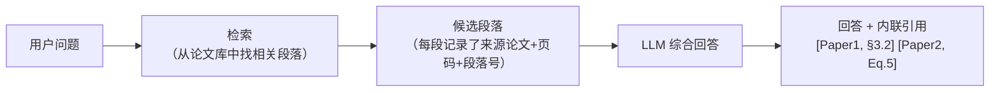
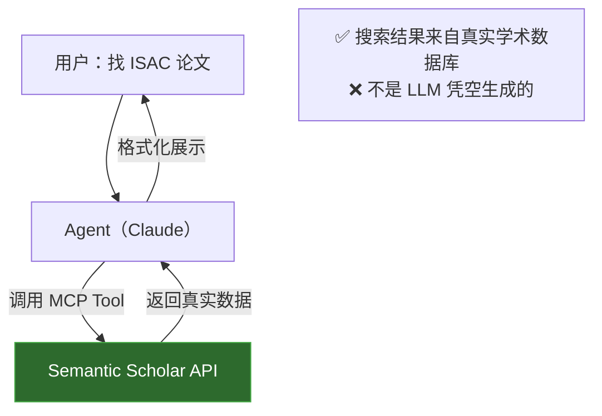
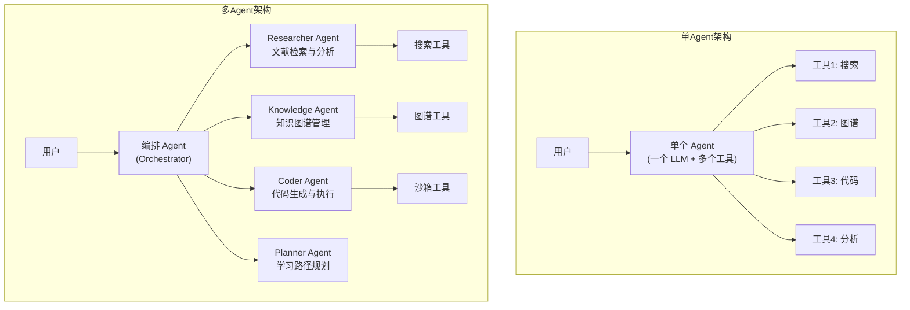
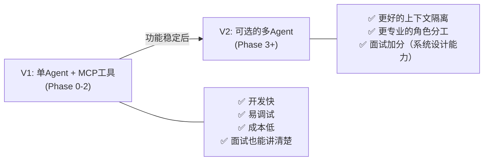

# 技术疑问深度解答与架构决策

> **文档定位**: 针对前三份文档中的具体疑问，给出面试级深度的技术解答
> **更新时间**: 2026-04-15

---

## 一、PaperQA2 技术细节深度解析

### 1.1 什么是"引用追溯"（Citation Grounding）？

> **核心理念**：AI 给出的每一个论断，都必须可以追溯到原始论文中的具体段落。

**传统 LLM 的问题**：
```
用户: "ISAC 中感知性能受限于什么？"
普通 ChatGPT: "ISAC 中感知性能主要受限于波束宽度和信噪比..."
                  ↑ 这个回答是对是错？来源在哪？你无法验证。
```

**PaperQA2 的引用追溯**：
```
用户: "ISAC 中感知性能受限于什么？"
PaperQA2: "ISAC 中感知性能主要受限于以下因素：
  1. 通感一体波形的模糊函数特性 [Zhang et al., 2023, 第3节, 段落2]
  2. 感知信号与通信信号的功率分配比 [Liu et al., 2022, 公式(12)]
  ..."
  ↑ 每个论断都标注了具体出处（论文+章节+段落），你可以回去原文核实
```

**技术机制**：


**与你的项目的关系**：你的 ScholarMind 也应该实现引用追溯——这对学术场景是**必须**的。实现方式是在 RAG 检索时保留 chunk 的元数据（来源论文、页码、段落位置），在生成回答时要求 LLM 标注引用来源。

---

### 1.2 什么是"引用准确率极高"？

**概念**：引用准确率 = LLM 回答中标注的引用，有多少能在原文中被验证为真实支撑。

```
引用准确率 = (真实支撑的引用数) / (总引用数) × 100%
```

**对比**：

| 系统 | 引用准确率 |
|:---|:---|
| 普通 ChatGPT | ~40-60%（经常编造不存在的论文，或张冠李戴） |
| RAG 系统（一般） | ~70-80% |
| **PaperQA2** | **~90-95%** |

**为什么 PaperQA2 做得好？**
- **Agentic 迭代检索**：不是检索一次就回答，而是"检索→不够→换关键词→再检索→确认→回答"
- **Citation grounding**：强制 LLM 只基于检索到的段落回答，而非自身知识
- **矛盾检测**：如果检索到的段落之间有矛盾，会标注出来而非随意选取

---

### 1.3 什么是"矛盾检测"（Contradiction Detection）？

学术文献中，不同论文对同一问题可能有**相反结论**。

**例子**：
```
论文A (2022): "RIS 在低 SNR 场景下可以显著提升感知精度"
论文B (2024): "RIS 在低 SNR 场景下带来的增益有限，主要瓶颈是相位误差"
```

**普通 RAG**:  会随机选一个论文的结论回答你，另一个被忽略
**PaperQA2**:  会检测到矛盾，并明确告诉你：
```
"关于 RIS 在低 SNR 下的效果，文献中存在分歧：
 - 支持方 [Zhang et al., 2022]: ...
 - 质疑方 [Li et al., 2024]: ...原因是...
 请结合你的具体场景判断。"
```

**技术实现**：本质是在 retrieval 阶段对多个 chunk 做 stance detection（立场检测），然后在 prompt 中引导 LLM 对比呈现而非单方面总结。

---

### 1.4 学术 Benchmark 与 SOTA

**Benchmark 是什么**：学术领域评测 AI 系统的标准化测试集，类似于高考。

**PaperQA2 的主要 benchmark**：

| Benchmark | 内容 | PaperQA2 表现 |
|:---|:---|:---|
| **LitQA** / **LitQA2** | 基于真实科学文献的问答测试集，问题需要检索多篇论文才能回答 | 超过人类专家水平（FutureHouse 自己发的论文 claim） |
| **ContraCrow** | 检测论文之间的矛盾/一致性 | 高矛盾识别率 |

**"SOTA" = State Of The Art = 当前最优**。意思是在这些 benchmark 上，PaperQA2 的得分是所有已知系统中最高的（截至其论文发表时）。

> [!NOTE]
> **面试相关**：如果面试官问"你参考了哪些系统？"，你可以说"PaperQA2 是 scientific RAG 领域的 SOTA 系统，在 LitQA2 benchmark 上超过了人类专家水平。我的项目在此基础上增加了多模态理解和知识图谱能力。"

---

## 二、论文来源真实性保障

### 2.1 为什么不用担心论文是 LLM 编造的

> **核心原则**：论文搜索走的是外部 API（Semantic Scholar / arXiv），不是 LLM 自己编的。



**关键设计**：
1. **论文搜索 = 工具调用，不是 LLM 生成**。LLM 只负责"决定何时搜索"和"格式化搜索结果"，搜索结果本身来自 Semantic Scholar 的真实索引（超过 2 亿篇论文）
2. **每篇论文都有唯一 ID**（Semantic Scholar Paper ID / DOI / arXiv ID），可以一键跳转到原始页面验证
3. **额外保险措施**：可以在工具返回后增加一层验证——检查返回的论文是否有 DOI 或 arXiv ID，如果没有则标注为"未验证"

### 2.2 本地 PDF 支持

**必须支持。** 这是核心功能之一。实际上你的论文来源应该有三个层次：

```
论文来源体系:
├── 在线搜索（远程）
│   ├── Semantic Scholar API  →  2亿+ 论文索引
│   ├── arXiv API             →  开放获取预印本
│   └── [可选] CrossRef API   →  DOI 解析
│
├── 本地文档（本地）
│   ├── PDF 文件直接上传/指定路径
│   ├── 文件夹批量导入
│   └── Zotero 库导入（进阶功能）
│
└── 混合模式
    └── 在知识图谱中统一管理所有来源
```

**本地 PDF 处理流程**：
```
本地PDF → PDF解析（文本+图表） → 向量化存储（ChromaDB） → RAG 可检索
                                          ↓
                               知识图谱抽取（实体+关系）→ 图谱存储
```

---

## 三、MVP 解释

**MVP = Minimum Viable Product = 最小可行产品**

> 用最少的功能实现核心价值，快速验证想法是否可行，然后再迭代增加功能。

| | "大而全" 开发 | MVP 开发 |
|:---|:---|:---|
| 策略 | 设计完所有功能再开发 | 先做最小版跑通，再加功能 |
| 风险 | 开发3个月才发现方向不对 | 1周就能验证方向 |
| 心态 | "等全做完再展示" | "先能用再完善" |

**你的项目 MVP**：
- Phase 0 的 MVP = 能在 Claude Code 里搜索论文并返回结果
- Phase 1 的 MVP = 能把一页 PDF 截图发给 Claude Vision 并得到分析
- Phase 2 的 MVP = 能从一篇论文中抽取 5 个以上的实体和关系

每个 Phase 都先 MVP，验证可行，再深化。

---

## 四、单 Agent vs 多 Agent 架构决策

### 4.1 架构对比



### 4.2 优缺点对比

| 维度 | 单 Agent | 多 Agent |
|:---|:---|:---|
| **复杂度** | ⭐ 低 | ⭐⭐⭐⭐ 高 |
| **开发成本** | 1周能跑起来 | 3-4周起步 |
| **调试难度** | 容易。一个日志流 | 困难。多个 Agent 交互，链路追踪复杂 |
| **成本控制** | 一个 LLM 调用 | 多个 LLM 并行调用，Token 成本翻倍 |
| **专业性** | 一个 Agent 要"什么都会" | 每个 Agent 有专精的 system prompt |
| **可扩展性** | 工具多了会让 Agent 困惑（工具选择难度↑） | 好扩展。新功能 = 新增一个子 Agent |
| **容错性** | 一个环节出错整个流程挂 | 某个子 Agent 失败可以重试/跳过 |
| **上下文管理** | 共享上下文，容易超窗 | 各 Agent 独立上下文，更灵活 |

### 4.3 Agent Laboratory 的多 Agent 为什么这样设计？

Agent Laboratory 的三个 Agent 各司其职：

```
Researcher Agent  ──→  接收研究 idea
      │                   ↓ 产出: 文献综述
      ↓
Experimenter Agent ──→  基于文献综述设计实验
      │                   ↓ 产出: 代码 + 实验结果
      ↓
Writer Agent      ──→  基于实验结果撰写报告
                          ↓ 产出: LaTeX 论文
```

**为什么要多 Agent？**
- 每个阶段需要的 LLM 能力和 system prompt 差异很大
- 避免单 Agent 上下文超窗（一次 research session 可能产生 10 万+ token）
- 流水线可以断点续传（Experimenter 失败不影响已有的文献综述）

**它的问题在于**：
- Agent 之间的信息传递会丢失细节（"压缩后遗症"）
- 调试极其痛苦——某个 Agent 的输出不对，要追溯到底是哪个 Agent 在哪一轮出了问题
- 成本高昂——每个 Agent 都是独立的 LLM 会话

### 4.4 ScholarMind 的架构决策：从单 Agent 起步

> [!IMPORTANT]
> **建议：Phase 0-2 用单 Agent，Phase 3+ 考虑引入多 Agent。**

**理由**：



**单 Agent 阶段的关键设计**：
- Claude Code 本身就是一个强大的单 Agent（LLM + 工具调用）
- 你通过 MCP Server 给它扩展工具（搜索、知识图谱、代码执行）
- 通过 CLAUDE.md 中精心设计的 system prompt 控制它的行为

**何时引入多 Agent**：
- 当你发现单 Agent 的 context window 经常超限（同时处理多篇论文+知识图谱+代码时）
- 当你需要并行处理（比如同时搜索论文+更新图谱+生成代码）
- 当你想展示面试中"系统设计"能力时

**引入多 Agent 的方式（不需要重写）**：
```python
# 单Agent → 多Agent 的最简过渡方案
# 不是从零搭建多Agent框架，而是在 MCP Tool 内部启动子Agent

@mcp.tool()
async def deep_paper_analysis(pdf_path: str) -> str:
    """
    深度分析一篇论文（内部使用专属 sub-agent）
    """
    # 这个工具内部启动一个独立的 Claude 会话
    # 有自己的 system prompt（专注论文分析）
    # 有自己的上下文（不会污染主 Agent 的上下文）
    
    analysis_agent = anthropic.Anthropic()
    result = analysis_agent.messages.create(
        model="claude-sonnet-4-20250514",
        system="你是论文深度分析专家...",  # 专属 prompt
        messages=[{"role": "user", "content": paper_content}],
    )
    return result.content[0].text
```

> [!TIP]
> **面试叙事**：你可以说"项目从单 Agent 起步以快速验证价值，随着功能增长发现上下文管理成为瓶颈，我通过在 MCP Tool 内部引入 sub-agent 的方式渐进式演化到多 Agent 架构，避免了整体重构的风险。"这比一开始就搞多 Agent 更有说服力——说明你理解**渐进式架构演进**。

---

## 五、Phase 顺序调整

根据你的反馈，代码执行难度较高，建议调整为：

```
Phase 0: 基石搭建（1周）
  └─ 环境 + 第一个 MCP Server + CLAUDE.md

Phase 1: 多模态论文理解（2-3周）
  └─ PDF解析 + 图表理解 + 本地PDF支持

Phase 2: 知识图谱（2-3周）
  └─ 实体/关系抽取 + 图谱存储 + 查询

Phase 3: 学习路径规划（1-2周）⬆ 提前
  └─ 知识盲区检测 + 推荐（依赖Phase2的图谱）

Phase 4: 代码执行与实验复现（2-3周）⬇ 延后
  └─ 沙箱 + 模板 + 生成 + 执行

Phase 5: 工程化与进阶（持续）
  └─ 评测 + 多Agent演进 + 优化
```

**调整理由**：
1. 学习路径规划基于知识图谱的图分析算法（PageRank 变体、连通分量分析），技术上直接承接 Phase 2
2. 代码执行需要 Docker 沙箱、安全隔离、错误恢复等重工程，独立性强，放后面不影响前面功能
3. 学习路径规划对用户感知价值更高，尽早让你自己也能"用起来"
