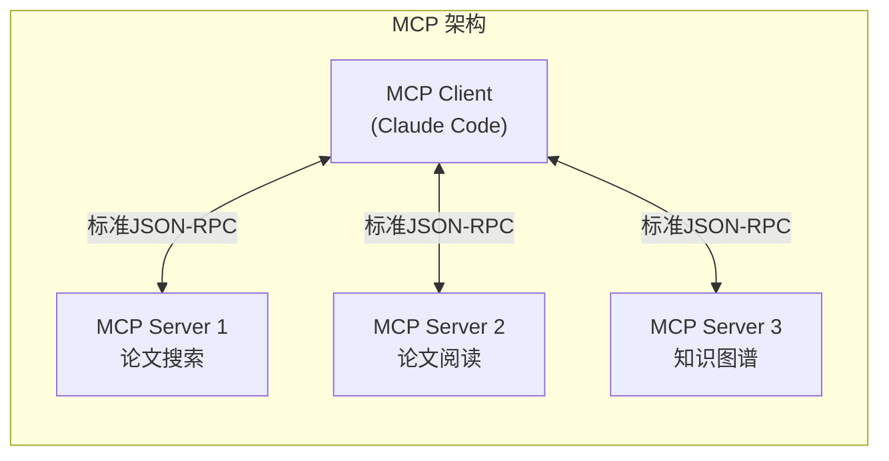
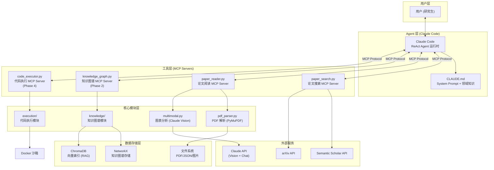
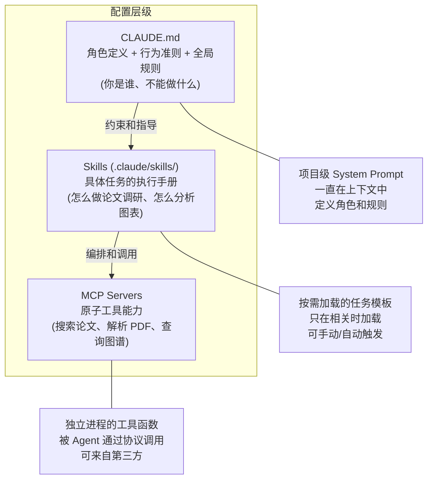
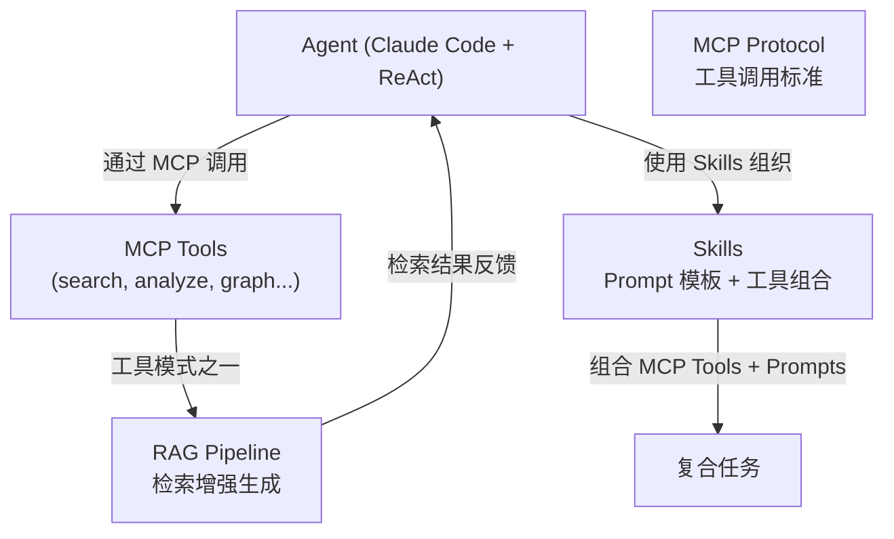
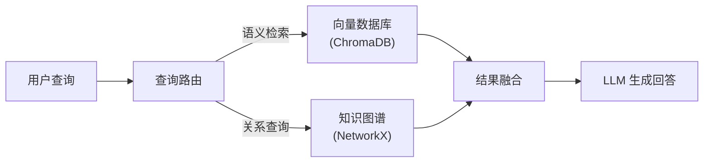
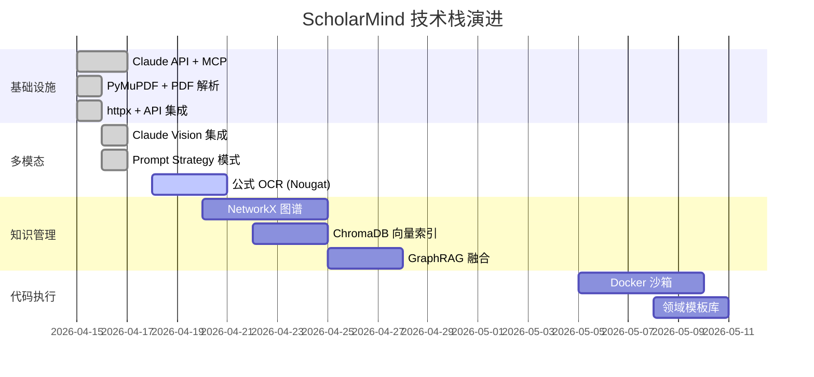

# 技术栈全景与架构决策

> **文档定位**: 全面回答"为什么选这些技术栈、不选那些"的工程决策文档
> **更新时间**: 2026-04-17
> **更新策略**: 随着项目推进持续更新，每个新技术选型决策都在此记录

---

## 一、项目搭建整体流程

```
┌─────────────────────────────────────────────────────────────────────────────┐
│                     ScholarMind 项目搭建全流程                               │
├─────────────────────────────────────────────────────────────────────────────┤
│                                                                             │
│  Phase 0              Phase 1              Phase 2                          │
│  基石搭建             多模态理解            知识图谱                          │
│ ┌──────────┐        ┌──────────┐        ┌──────────┐                       │
│ │ 论文搜索  │───────▶│Vision分析│───────▶│Schema设计│                       │
│ │ PDF解析   │        │结构解析  │        │实体抽取  │                       │
│ │ MCP框架   │        │Reader MCP│        │图谱存储  │                       │
│ │ 文档体系  │        │Prompt迁移│        │向量索引  │                       │
│ └──────────┘        └──────────┘        └────┬─────┘                       │
│   4 Tools              4 Tools               │ 4 Tools                      │
│   ~1,200 行            ~1,000 行             │ ~1,400 行                    │
│                                              │                              │
│            ┌─────────────────────────────────┘                              │
│            │                                                                │
│            ▼                                                                │
│  Phase 3              Phase 4              Phase 5                          │
│  学习路径             代码执行              工程化                            │
│ ┌──────────┐        ┌──────────┐        ┌──────────┐                       │
│ │PageRank  │───────▶│安全沙箱  │───────▶│CI/CD     │                       │
│ │盲区检测  │        │代码模板  │        │简历文档  │                       │
│ │拓扑排序  │        │MCP Server│        │全量测试  │                       │
│ └──────────┘        └──────────┘        └──────────┘                       │
│   3 Tools              4 Tools              79 Tests                        │
│   ~640 行              ~890 行              ~400 行                          │
│                                                                             │
├─────────────────────────────────────────────────────────────────────────────┤
│  合计: 5 MCP Server │ 19 Tools │ 79 Tests │ ~5,530 行 │ 9 篇文档          │
└─────────────────────────────────────────────────────────────────────────────┘
```

**搭建流程详解**：

1. **Phase 0 – 基石搭建**：确立项目架构（MCP Server 模式）、搭建开发环境、实现第一个端到端的工具链（论文搜索），验证技术路线可行性。
2. **Phase 1 – 多模态理解**：在 PDF 解析基础上，集成 Claude Vision API 实现图表/公式/框图理解，建立 Strategy 模式的多类型分析器。
3. **Phase 2 – 知识图谱**：设计领域 Schema，实现 LLM 驱动的实体/关系抽取 pipeline，使用 NetworkX 存储和 ChromaDB 向量索引。
4. **Phase 3 – 学习规划**：基于知识图谱做图分析（PageRank、连通分量），检测知识盲区，推荐学习路径。
5. **Phase 4 – 代码执行**：Docker 沙箱隔离 + 领域代码模板 + 论文→代码桥接。
6. **Phase 5 – 工程化**：评测体系、多 Agent 演进、性能优化。

---

## 一.五、系统总体架构图

```
┌─────────────────────────────────────────────────────────────────────────────────┐
│                              用户层 (User Layer)                                │
│                                                                                 │
│   研究生 / 博士生                                                                │
│     │  "帮我搜 ISAC 论文"  "分析这张图"  "我该学什么"  "跑个 OFDM 仿真"          │
│     ▼                                                                           │
│  ┌──────────────────────────────────────────────────────────────────────────┐    │
│  │                    Claude Code (Agent 运行环境)                          │    │
│  │                                                                          │    │
│  │  ┌─────────────┐  ┌──────────────┐  ┌───────────────┐                   │    │
│  │  │ ReAct 推理  │  │ Prompt 模板  │  │ SKILL 工作流  │                   │    │
│  │  │ (思考→行动  │  │ (5 个 .txt)  │  │ (5 个 .md)    │                   │    │
│  │  │  →观察循环) │  │              │  │               │                   │    │
│  │  └──────┬──────┘  └──────────────┘  └───────────────┘                   │    │
│  │         │ MCP Protocol (JSON-RPC over stdio)                             │    │
│  └─────────┼────────────────────────────────────────────────────────────────┘    │
│            │                                                                     │
├────────────┼─────────────────────────────────────────────────────────────────────┤
│            │            MCP Server 层 (19 Tools)                                 │
│            │                                                                     │
│   ┌────────▼────────┐  ┌─────────────────┐  ┌─────────────────┐                 │
│   │  paper-search   │  │  paper-reader    │  │ knowledge-graph │                 │
│   │  (4 tools)      │  │  (4 tools)       │  │  (4 tools)      │                 │
│   │                 │  │                  │  │                  │                 │
│   │ search_papers   │  │ analyze_pdf      │  │ add_paper_to_   │                 │
│   │ get_details     │  │ analyze_figure   │  │   graph          │                 │
│   │ get_related     │  │ analyze_page     │  │ query_knowledge  │                 │
│   │ search_arxiv    │  │ get_structure    │  │ get_stats        │                 │
│   └────────┬────────┘  └────────┬─────────┘  │ get_related      │                 │
│            │                    │             └────────┬─────────┘                 │
│   ┌────────▼────────┐  ┌───────▼──────────┐  ┌───────▼──────────┐               │
│   │  learning-path  │  │  code-execution  │  │                  │               │
│   │  (3 tools)      │  │  (4 tools)       │  │   .claude/       │               │
│   │                 │  │                  │  │   mcp.json       │               │
│   │ analyze_        │  │ run_code         │  │   (服务注册表)    │               │
│   │   knowledge     │  │ run_template     │  │                  │               │
│   │ detect_gaps     │  │ list_templates   │  │                  │               │
│   │ get_importance  │  │ explain_template │  │                  │               │
│   └────────┬────────┘  └────────┬─────────┘  └──────────────────┘               │
│            │                    │                                                 │
├────────────┼────────────────────┼─────────────────────────────────────────────────┤
│            │       核心模块层 (Core Modules)                                      │
│            │                    │                                                 │
│   ┌────────▼────────┐  ┌───────▼──────────┐  ┌──────────────────┐               │
│   │  src/knowledge/  │  │  src/execution/  │  │   src/core/      │               │
│   │                 │  │                  │  │                  │               │
│   │ schema.py       │  │ sandbox.py       │  │ pdf_parser.py    │               │
│   │  └ 7 节点类型   │  │  └ subprocess    │  │  └ PyMuPDF       │               │
│   │  └ 11 关系类型  │  │  └ 超时控制      │  │                  │               │
│   │                 │  │  └ 安全扫描      │  │ multimodal.py    │               │
│   │ graph_store.py  │  │  └ 图表自动保存  │  │  └ Vision API    │               │
│   │  └ NetworkX     │  │                  │  │  └ Strategy 模式 │               │
│   │  └ JSON 持久化  │  │ templates.py     │  │                  │               │
│   │                 │  │  └ OFDM 模板     │  │                  │               │
│   │ extractor.py    │  │  └ MIMO 模板     │  │                  │               │
│   │  └ Claude API   │  │  └ MUSIC 模板    │  │                  │               │
│   │  └ 3级JSON容错  │  │  └ 参数覆盖API   │  │                  │               │
│   │                 │  │                  │  │                  │               │
│   │ graph_analyzer  │  │                  │  │                  │               │
│   │  └ PageRank     │  │                  │  │                  │               │
│   │  └ 盲区检测     │  │                  │  │                  │               │
│   │  └ 拓扑排序     │  │                  │  │                  │               │
│   └─────────────────┘  └──────────────────┘  └──────────────────┘               │
│                                                                                  │
├──────────────────────────────────────────────────────────────────────────────────┤
│                           外部依赖层 (External)                                  │
│                                                                                  │
│   ┌──────────┐  ┌──────────┐  ┌──────────┐  ┌──────────┐  ┌──────────┐         │
│   │ Claude   │  │ Semantic │  │  arXiv   │  │ NetworkX │  │  pytest  │         │
│   │ API      │  │ Scholar  │  │  API     │  │ + JSON   │  │  + CI/CD │         │
│   │ (推理+   │  │ API      │  │          │  │          │  │  GitHub  │         │
│   │  Vision) │  │ (引用)   │  │ (预印本) │  │ (图存储) │  │  Actions │         │
│   └──────────┘  └──────────┘  └──────────┘  └──────────┘  └──────────┘         │
│                                                                                  │
└──────────────────────────────────────────────────────────────────────────────────┘

数据流:  用户自然语言 → Claude ReAct → MCP Tool 调用 → 核心模块处理 → 结构化结果返回
```

---

## 二、完整技术栈全景表

| 层级 | 技术 | 版本 | 职责 | 当前状态 |
|:-----|:-----|:-----|:-----|:---------|
| **LLM 核心** | Claude API (Anthropic) | claude-sonnet-4 | 推理引擎 + 多模态理解 | ✅ 使用中 |
| **工具协议** | MCP (Model Context Protocol) | MCP SDK ≥1.0 | Agent ↔ 工具标准化通信 | ✅ 使用中 |
| **运行宿主** | Claude Code | - | Agent 运行环境 + 用户交互 | ✅ 使用中 |
| **PDF 解析** | PyMuPDF (fitz) | ≥1.24 | 文本/图片提取 + 页面渲染 | ✅ 使用中 |
| **HTTP 客户端** | httpx | ≥0.27 | 异步 API 请求 + 重试 | ✅ 使用中 |
| **环境管理** | python-dotenv | ≥1.0 | API Key 安全管理 | ✅ 使用中 |
| **终端美化** | rich | ≥13.0 | 调试输出格式化 | ✅ 使用中 |
| **向量数据库** | ChromaDB | ≥0.5 | RAG 论文段落检索 | ⬜ Phase 2 |
| **图数据库** | NetworkX → Neo4j | ≥3.2 | 知识图谱存储与查询 | ⬜ Phase 2 |
| **代码沙箱** | Docker | - | 安全代码执行隔离 | ⬜ Phase 4 |
| **测试框架** | pytest + pytest-asyncio | ≥8.0 | 单元/集成测试 | ✅ 使用中 |
| **版本控制** | Git + GitHub | - | 代码管理与协作 | ✅ 使用中 |
| **Python** | 3.10 (specSen_torch env) | - | 开发语言 | ✅ 使用中 |

---

## 三、为什么选这些技术栈？为什么不选其他？

### 3.1 LLM 选型：Claude API

#### ✅ 选择理由

| 维度 | Claude | GPT-4 | 开源模型 (Llama/Qwen) |
|:-----|:-------|:------|:---------------------|
| **多模态能力** | ⭐⭐⭐⭐⭐ Vision 原生支持 | ⭐⭐⭐⭐⭐ | ⭐⭐⭐ 需要额外集成 |
| **长上下文** | 200K tokens | 128K tokens | 8K-32K（多数情况） |
| **学术文本理解** | ⭐⭐⭐⭐⭐ 优秀 | ⭐⭐⭐⭐ 优秀 | ⭐⭐⭐ 较弱 |
| **Tool Use 原生支持** | ✅ MCP 标准 | ✅ Function Calling | ❌ 需要额外适配 |
| **代码生成能力** | ⭐⭐⭐⭐⭐ | ⭐⭐⭐⭐ | ⭐⭐⭐ |
| **成本控制** | Sonnet 性价比最高 | GPT-4o 相当 | 本地部署免费但需 GPU |

**关键决策因素**：
1. **MCP 是 Anthropic 原生协议**：Claude Code + MCP Server 是最流畅的开发体验
2. **200K 上下文窗口**：学术论文全文分析场景需要超长上下文
3. **Vision 能力**：图表理解是项目核心差异化能力

#### ❌ 为什么不选其他
- **GPT-4**：Function Calling 生态成熟，但缺乏 MCP 原生支持；Claude Code 的 Agent 开发体验更好
- **开源模型**：无法在本地运行（需 80GB+ VRAM），多模态能力不足，Tool Calling 需要大量适配工作
- **Gemini**：多模态能力强，但 Agent 工具调用生态不如 Claude/GPT 成熟

---

### 3.2 工具协议：MCP (Model Context Protocol)

#### ✅ 选择理由



| 维度 | MCP | 直接 API 调用 | LangChain Tools |
|:-----|:----|:-------------|:---------------|
| **标准化** | ✅ 开放协议标准 | ❌ 各自定义 | ❌ 框架锁定 |
| **可移植性** | 任何 MCP Client 都能用 | 仅限当前项目 | 仅限 LangChain |
| **部署灵活** | stdio/SSE/HTTP | - | - |
| **工具发现** | 自动 schema 生成 | 手动定义 | 半自动 |
| **进程隔离** | ✅ 独立进程 | ❌ 同进程 | ❌ 同进程 |

**关键决策因素**：
1. **协议级标准** > 框架级绑定：MCP Server 不绑定任何 LLM 框架，未来可被 VSCode、Cursor、任何 MCP Client 复用
2. **进程隔离**：每个 MCP Server 是独立进程，一个 Server 崩溃不影响其他
3. **与 Claude Code 原生集成**：`claude mcp add` 一行命令注册
4. **面试叙事价值**：展示了对"协议 vs 框架"的深层理解

#### ❌ 为什么不用直接的 Function Calling
- Function Calling 是模型层的能力（Claude 原生支持），MCP 是在此基础上的**协议封装**
- MCP 提供了标准化的工具注册、发现、调用接口，而裸 Function Calling 需要手动管理这些
- **两者不是互斥的**：MCP Server 内部就是通过 Function Calling 暴露工具给 LLM

---

### 3.3 Agent 运行模式：ReAct

> **是的，ScholarMind 的 Agent 以 ReAct (Reasoning + Acting) 模式运行。**

#### ReAct 在本项目中的体现

```
用户: "帮我找 ISAC 信道估计的论文并分析第一篇的系统框图"

Agent 思考 (Reason): 需要先搜索论文
Agent 行动 (Act): 调用 search_papers("ISAC channel estimation")
Agent 观察 (Observe): 返回 5 篇论文

Agent 思考 (Reason): 用户要分析第一篇的框图，需要获取 PDF
Agent 行动 (Act): 调用 get_paper_details(paper_id)
Agent 观察 (Observe): 获得 PDF 链接

Agent 思考 (Reason): 需要分析其中的系统框图
Agent 行动 (Act): 调用 analyze_figure(pdf_path, page_num=2)
Agent 观察 (Observe): 返回框图分析结果

Agent 回答: 综合搜索结果和图表分析，给出完整回答
```

#### 为什么是 ReAct 而不是其他模式？

| 模式 | 描述 | 适用场景 | 为什么不选 |
|:-----|:-----|:---------|:----------|
| **ReAct** ✅ | 交替推理和行动 | 多步骤的工具调用任务 | **已选择** |
| Plan-and-Execute | 先生成完整计划再执行 | 复杂的多阶段任务 | 学术场景交互性强，需要实时调整 |
| Reflexion | 自我反思和修正 | 需要迭代改进输出 | 增加复杂度和成本，MVP 阶段不需要 |
| Tree of Thoughts | 探索多条推理路径 | 复杂推理和创作 | 学术工具调用场景不需要多路探索 |

**关键点**：Claude Code 本身就是以 ReAct 模式运行的 Agent——它读取用户指令，思考需要什么信息/工具，执行工具调用，观察结果，再继续推理。我们的 MCP Server 就是它的 Action 集合。

---

### 3.4 为什么不用 LangChain / LangGraph？

> [!IMPORTANT]
> 这是面试高频问题。以下是完整的工程理由。

#### ❌ 不使用 LangChain 的理由

| 维度 | 说明 |
|:-----|:-----|
| **抽象过度** | LangChain 的 Chain→Agent→Tool 多层嵌套让调试极其困难。一个 `search_papers` 调用失败时，你要穿透 5+ 层抽象才能找到根因 |
| **框架锁定** | 用 LangChain 定义的 Tool 只能在 LangChain 生态中使用；MCP Tool 可以被任何 MCP Client 调用 |
| **版本混乱** | LangChain 版本迭代激进（v0.1→v0.2→v0.3 大量 breaking changes），API 稳定性差 |
| **学习目的** | 直接使用 Claude API + MCP SDK 让我理解了 Agent 的底层原理（Tool Schema、ReAct Loop、Context Management），而非被框架屏蔽了细节 |
| **性能损耗** | LangChain 增加了额外的序列化/反序列化开销，对于延迟敏感的学术交互场景不合适 |

#### ❌ 不使用 LangGraph 的理由

| 维度 | 说明 |
|:-----|:-----|
| **复杂度不匹配** | LangGraph 适合多 Agent 协作的有向图工作流，但 ScholarMind MVP 阶段是单 Agent + MCP Tools |
| **引入时机** | 如果未来 Phase 5 引入多 Agent 架构（文献 Agent + 知识图谱 Agent + 代码 Agent），可以考虑 LangGraph |
| **替代方案** | 在 MCP Tool 内部启动 sub-agent（见 ADR-001）是更轻量的多 Agent 方案 |

#### 面试回答模板

> "我评估了 LangChain/LangGraph，最终选择 Claude API + MCP 的原生方案。原因有三：
> 1. MCP 是协议级标准，不绑定框架，可移植性更好
> 2. 直接用 API 让我充分理解了 Agent 底层机制（ReAct Loop、Tool Schema、Context Management）
> 3. LangChain 的多层抽象在调试和性能上增加了不必要的复杂度
>
> 如果未来项目需要复杂的多 Agent 编排（DAG 工作流+条件分支+并行处理），我会考虑引入 LangGraph。"

---

### 3.5 PDF 解析：PyMuPDF

| 方案 | 优点 | 缺点 | 为什么选/不选 |
|:-----|:-----|:-----|:-------------|
| **PyMuPDF** ✅ | 速度快、功能全、支持图片提取+页面渲染 | C 扩展依赖 | **选择**：学术 PDF 需要图表提取和页面渲染 |
| pdfplumber | 文本提取更精确（尤其表格） | 不支持页面渲染为图片 | 不选：缺少 Vision 分析的渲染能力 |
| pypdf | 最轻量 | 功能有限 | 不选：功能不够 |
| Marker/Nougat | 学术 PDF 专用 OCR | 重型模型+GPU 依赖 | 备选：扫描版 PDF 需要时再引入 |

---

### 3.6 向量数据库：ChromaDB（Phase 2 使用）

| 方案 | 优点 | 缺点 | 为什么选/不选 |
|:-----|:-----|:-----|:-------------|
| **ChromaDB** ✅ | 嵌入式（无需额外部署服务器）、API 简洁 | 大规模性能有限（>100万向量） | **选择**：个人使用场景 <1000 篇论文 |
| FAISS | Facebook 出品、速度极快 | 不含元数据管理、需要手动封装 | 不选：需要额外的元数据存储 |
| Pinecone | 托管服务、运维简单 | 付费、数据在云端 | 不选：学术数据不想放云端 |
| Milvus | 大规模向量检索 | 部署重型 | 不选：过于重型 |
| Weaviate | 功能全面 | 学习曲线陡峭 | 不选：MVP 阶段不需要 |

---

### 3.7 知识图谱存储：NetworkX → Neo4j

| 方案 | 优点 | 缺点 | 为什么选/不选 |
|:-----|:-----|:-----|:-------------|
| **NetworkX** ✅ (MVP) | 纯 Python、无需数据库部署、开发快 | 大规模查询慢、无持久化引擎 | **选择**：MVP 阶段 <100 篇论文够用 |
| **Neo4j** (Phase 5) | 最成熟图数据库、Cypher 查询强大 | 需要部署服务、学习 Cypher | **后续迁移**：用户量/数据量增长后 |
| ArangoDB | 多模型数据库 | 社区小 | 不选：生态不如 Neo4j |
| 纯 JSON 文件 | 最简单 | 无查询能力 | 不选：即便 MVP 也需要基本图查询 |

---

## 四、技术栈在项目中的协作关系



### 各技术栈的协作流程（一次完整的论文分析）

```
1. 用户 → Claude Code: "帮我分析这篇 ISAC 论文的系统框图"
   
2. Claude Code (Agent, ReAct 推理):
   "需要先解析 PDF，使用 paper_reader MCP Server"
   
3. Claude Code → paper_reader.py (MCP Protocol):
   调用 analyze_figure(pdf_path, page=2)
   
4. paper_reader.py → pdf_parser.py (PyMuPDF):
   提取第 2 页的嵌入图片 → base64
   
5. paper_reader.py → multimodal.py (FigureAnalyzer):
   Strategy 模式选择分析 Prompt
   
6. multimodal.py → Claude Vision API (Anthropic):
   base64 图片 + 通信领域 Prompt → JSON 结构化结果
   
7. 结果回传: Claude Vision → multimodal → paper_reader → Claude Code → 用户
   
8. Claude Code (ReAct 继续推理):
   "需要把提取的实体存入知识图谱"
   调用 knowledge_graph MCP Server (Phase 2)
```

---

## 五、MCP、Skills、RAG 的关系辨析

### 5.1 MCP (Model Context Protocol)

**角色**：Agent 调用外部工具的标准化通信协议

```
MCP ≈ "Agent 的 USB 接口"

它定义了：
├── Tool：工具函数（search_papers, analyze_figure...）
├── Resource：数据源（知识图谱状态、论文库索引...）
├── Prompt：预定义的提示模板
└── Transport：通信方式（stdio/SSE/HTTP）
```

**本项目使用情况**：✅ 核心使用
- paper_search.py：4 个 MCP Tool
- paper_reader.py：4 个 MCP Tool
- 后续每个新模块都以 MCP Server 形式暴露

### 5.2 Skills（深度展开）

#### 5.2.1 什么是 Skills？

**Skills** 是 Agent 的**可复用能力单元**。一个 Skill ≈ 一套完整的"做某件事"的指令包。

```
Skill 的三要素：
├── 触发条件：什么时候应该使用这个 Skill？
├── 执行指令：具体怎么做？（Prompt + 工具调用组合）
└── 输出格式：结果以什么形式返回？
```

**类比理解**：
- **MCP Tool** = 单个函数（如 `search_papers()`）
- **Skill** = 完整的工作流（如"论文深度调研" = 搜索→筛选→详读→总结→入知识图谱）
- **CLAUDE.md** = Agent 的"人格"和"规章制度"
- **Skill** = Agent 习得的"具体技能手册"

#### 5.2.2 Claude Code 的 Skills 系统

Claude Code 有一套原生的 Skills 机制，通过 **SKILL.md** 文件定义：

**目录结构**：
```
两种作用域：

项目级 Skills（Git 可追踪，团队共享）：
  .claude/skills/<skill-name>/SKILL.md

个人级 Skills（跨所有项目可用）：
  ~/.claude/skills/<skill-name>/SKILL.md
```

**SKILL.md 文件格式**：
```markdown
---
name: skill-name
description: 何时应该触发此 Skill 的描述（Claude 靠这个决定是否自动加载）
allowed-tools: Bash(git *), Read, Grep   # 限制可用工具
---

# 具体执行指令（Markdown）

当触发此 Skill 时，按以下步骤执行：
1. ...
2. ...
3. ...
```

**两种调用方式**：
| 方式 | 说明 |
|:-----|:-----|
| **手动调用** | 用户在 Claude Code 中输入 `/skill-name` 触发 |
| **自动调用** | Claude 根据 `description` 字段判断当前对话是否需要该 Skill，**自动加载**执行指令 |

**渐进式加载**（性能优化）：
- Claude 只在启动时读取所有 Skill 的 YAML 元数据（`name` + `description`）
- 只有当 Claude 判断某个 Skill 与当前任务相关时，才读取完整的指令内容
- 这样不会浪费上下文窗口

#### 5.2.3 Skills 在 ScholarMind 中的作用与实现

**当前实现（隐式 Skills）**：

目前 ScholarMind 的 Skills 是**隐式实现**的——嵌在 CLAUDE.md 的工作流程指令和 `multimodal.py` 的 Prompt 模板中，没有使用 `.claude/skills/` 目录结构。

```
当前隐式 Skills 清单：
├── 论文搜索 = CLAUDE.md 中的搜索规则 + search_papers MCP Tool
├── 论文图表分析 = multimodal.py 中的 Strategy Prompts + analyze_figure Tool
├── 论文结构解析 = PaperStructureParser + get_paper_structure Tool
└── 论文引用规则 = CLAUDE.md 中的"绝对禁止编造论文"指令
```

**应该迁移到显式 Skills**：

为了更好的模块化和可复用性，我们应该将隐式 Skills 迁移到 `.claude/skills/` 目录。以下是规划的 Skills：

| Skill 名称 | 触发场景 | 组合的工具 | 状态 |
|:-----------|:---------|:----------|:-----|
| `paper-research` | "帮我调研XXX领域" | search_papers + get_paper_details | 📋 规划中 |
| `paper-analysis` | "帮我分析这篇论文" | analyze_pdf + analyze_figure + get_paper_structure | 📋 规划中 |
| `knowledge-extract` | "把这篇论文加入知识图谱" | analyze_pdf + add_to_graph | 📋 Phase 2 |
| `literature-review` | "帮我做XXX的文献综述" | search_papers × N + knowledge_extract × N | 📋 Phase 2 |
| `code-reproduce` | "帮我复现这篇论文的方法" | analyze_pdf + code_template + sandbox_exec | 📋 Phase 4 |

**示例：`paper-research` Skill 的完整 SKILL.md**：

```markdown
---
name: paper-research
description: >
  论文调研技能。当用户说"帮我调研"、"搜索论文"、"xxx领域有哪些研究"、
  "找关于xxx的论文"时触发。执行多轮搜索、筛选和总结。
allowed-tools: search_papers, get_paper_details, search_arxiv, get_related_papers
---

# 论文调研流程

## 步骤

1. **理解需求**：
   - 确认用户的搜索意图和领域范围
   - 将用户的中文描述转为合适的英文关键词

2. **多源搜索**：
   - 使用 `search_papers` 在 Semantic Scholar 搜索（覆盖全面）
   - 使用 `search_arxiv` 搜索最新预印本（覆盖前沿）
   - 如果结果不足，尝试同义词/相关词重新搜索

3. **智能筛选**：
   - 按引用数和年份排序
   - 对前 3 篇使用 `get_paper_details` 获取完整信息
   - 优先推荐近 3 年、高引用的论文

4. **结构化输出**：
   - 为每篇论文提供：标题、核心贡献、适用场景
   - 标注每篇论文的验证链接（DOI/arXiv）
   - 给出论文之间的关系（互补/对比/改进）

5. **成本控制**：
   - 最多搜索 3 轮，每轮最多 5 篇
   - 引用链追踪最多 2 层深度

## 输出格式
使用 Markdown 表格 + 分条总结
```

**示例：`paper-analysis` Skill 的 SKILL.md**：

```markdown
---
name: paper-analysis
description: >
  论文深度分析技能。当用户提供了 PDF 文件路径并要求"分析论文"、
  "看看这篇论文说了什么"、"帮我读这篇论文"时触发。
allowed-tools: analyze_pdf, analyze_figure, analyze_page, get_paper_structure
---

# 论文深度分析流程

## 步骤

1. **结构扫描**：
   - 使用 `get_paper_structure` 获取章节概览
   - 使用 `analyze_pdf` 获取元数据和摘要

2. **核心内容分析**：
   - 重点阅读 method 和 experiments 章节
   - 对包含图表的关键页面使用 `analyze_page` 进行 Vision 分析
   - 对核心图表（系统框图、性能曲线）使用 `analyze_figure` 详细分析

3. **知识提取**：
   - 提取核心方法、创新点、实验设置
   - 识别论文中的关键实体（概念、方法、数据集、指标）
   - 标注实体之间的关系

4. **结构化笔记输出**：
   按照以下结构组织：
   - 基本信息 → 研究问题 → 核心方法 → 关键公式
   - 实验设置 → 主要结论 → 局限性 → 知识图谱节点
```

#### 5.2.4 如何集成 GitHub 上现成的 Skills/MCP Servers？

> [!IMPORTANT]
> 在 Agent 生态中，"集成现成能力"有两条路径：
> 1. **集成现成的 MCP Server**（外部工具能力）
> 2. **集成 Claude Code 社区 Skills**（工作流 Prompt 模板）

##### 路径 1：集成 GitHub 上的 MCP Server（推荐！非常方便）

**生态现状**：MCP 生态已经非常丰富，有大量现成的 MCP Server 可以直接使用。

**核心资源**：

| 资源 | 地址 | 说明 |
|:-----|:-----|:-----|
| **awesome-mcp-servers** | github.com/wong2/awesome-mcp-servers | 最全面的社区目录 |
| **awesome-mcp-servers** | github.com/punkpeye/awesome-mcp-servers | 按类别组织的目录 |
| **mcp.science** | github.com/pathintegral-institute/mcp.science | **学术/科研专用 MCP Server**（与我们项目最相关！）|
| **MCP Registry** | 官方注册表 | Anthropic 维护的官方 Server 注册表 |

**与 ScholarMind 最相关的现成 MCP Server**：

| 现成 Server | 集成价值 | 集成方式 |
|:-----------|:---------|:---------|
| **mcp.science 中的学术搜索** | 可补充我们的 paper_search | `claude mcp add` |
| **GitHub MCP Server** | 管理项目代码和 Issue | 你现在已经在用了！ |
| **Filesystem MCP Server** | 文件系统操作 | 读取本地 PDF 文件 |
| **Puppeteer/Playwright MCP** | 网页抓取 | 抓取论文全文/GitHub repo |
| **SQLite MCP Server** | 本地数据库 | 替代 JSON 存储知识图谱 |
| **Docker MCP Server** | 容器管理 | Phase 4 代码沙箱 |

**集成步骤（以集成一个第三方 MCP Server 为例）**：

```powershell
# 方式 1：直接用 claude mcp add 注册（最简单）
# 安装 npm 包形式的 MCP Server
claude mcp add @anthropic/mcp-server-filesystem

# 方式 2：Python 包形式的 MCP Server
pip install some-mcp-server
claude mcp add some-server python -m some_mcp_server

# 方式 3：从 GitHub 克隆后本地运行
git clone https://github.com/xxx/xxx-mcp-server.git
cd xxx-mcp-server
pip install -r requirements.txt
claude mcp add xxx-server python main.py

# 方式 4：在 .claude/mcp.json 中配置（项目级）
```

`.claude/mcp.json` 配置文件示例：
```json
{
  "mcpServers": {
    "paper-search": {
      "command": "python",
      "args": ["src/mcp_servers/paper_search.py"],
      "env": {}
    },
    "paper-reader": {
      "command": "python",
      "args": ["src/mcp_servers/paper_reader.py"],
      "env": {}
    },
    "filesystem": {
      "command": "npx",
      "args": ["-y", "@anthropic/mcp-server-filesystem", "/path/to/papers"]
    }
  }
}
```

**集成的本质**：每个 MCP Server 是独立进程，通过标准 MCP 协议通信。集成第三方 Server 就是「多接一根 USB 线」——即插即用，不需要改动现有代码。

##### 路径 2：集成社区 Claude Code Skills

**方式**：直接将别人的 SKILL.md 文件复制到你的 `.claude/skills/` 目录即可。

```powershell
# 从 GitHub 克隆一个社区 Skills 仓库
git clone https://github.com/xxx/awesome-claude-skills.git

# 复制你需要的 Skill 到项目中
cp -r awesome-claude-skills/code-review .claude/skills/code-review

# 或复制到个人全局 Skills（跨项目可用）
cp -r awesome-claude-skills/code-review ~/.claude/skills/code-review

# 在 Claude Code 中验证
claude
# 输入 /skills 查看所有可用 Skills
```

> [!NOTE]
> 社区 Skills 生态相比 MCP Server 还更年轻一些。目前更多是开发者根据自己项目的需要手写 SKILL.md 文件，而非从社区库安装。MCP Server 生态则已经非常成熟，有数百个现成 Server 可以直接集成。

#### 5.2.5 Skills vs MCP Server vs CLAUDE.md 的分工



| 维度 | CLAUDE.md | Skills | MCP Server |
|:-----|:----------|:-------|:-----------|
| **内容** | 角色 + 规则 + 术语 | 任务流程 + Prompt 模板 | 工具函数实现 |
| **粒度** | 项目级（全局） | 任务级（按需） | 函数级（原子） |
| **加载时机** | 始终加载 | Claude 自动判断加载 | 被调用时执行 |
| **可共享性** | Git 追踪 | Git 追踪 | 独立进程+可安装 |
| **类比** | 员工手册 | 工作流 SOP | 生产工具箱 |

#### 5.2.6 为 ScholarMind 落地 Skills 的行动计划

```
待实施（作为 Phase 2 的一部分）：
├── [1] 创建 .claude/skills/ 目录结构
├── [2] 编写 paper-research/SKILL.md
├── [3] 编写 paper-analysis/SKILL.md
├── [4] 编写 knowledge-extract/SKILL.md (Phase 2 后)
├── [5] 创建 .claude/mcp.json 统一配置 MCP Servers
├── [6] 评估 mcp.science 中可集成的学术 MCP Server
└── [7] 集成 Filesystem MCP Server 用于本地 PDF 管理
```

### 5.3 RAG (Retrieval-Augmented Generation)

**角色**：让 Agent 基于检索到的真实文档内容回答问题，而非凭 LLM 内部知识编造

```
RAG 在本项目中的两层实现：

Layer 1: 在线检索 RAG（已实现）
├── 用户提问 → Agent 调用 search_papers → Semantic Scholar/arXiv 返回真实论文
└── Agent 基于 API 返回的真实数据生成回答 → 每篇论文有可验证的 DOI/arXiv ID

Layer 2: 本地知识库 RAG（Phase 2 实现）
├── 论文 PDF → 文本分块 → ChromaDB 向量化存储
├── 用户提问 → 向量检索 Top-K 相关段落 → 喂给 LLM
└── LLM 基于检索到的段落生成回答 + 内联引用（Citation Grounding）
```

**RAG 漏斗模型**（详见 `docs/05_Agent工程落地深度思考.md`）：
```
全量文档库 → BM25/向量粗筛 → Cross-Encoder 重排 → 阈值过滤 → LLM 生成 → 引用验证
```

### 5.4 三者的关系



**总结**：
- **MCP** 是通信协议（"怎么调用工具"）
- **RAG** 是一种工具模式（"怎么检索和生成"）
- **Skills** 是能力组织方式（"怎么组合工具和 Prompt"）
- 三者不互斥，而是**不同维度的组件**

---

## 六、知识图谱 vs RAG 向量数据库 —— 是否重叠？

> [!IMPORTANT]
> 这是一个非常好的问题。答案是：**不重叠，而是互补。** 两者共同构成了 GraphRAG 架构。

### 6.1 核心区别

| 维度 | 向量数据库 (ChromaDB) | 知识图谱 (NetworkX/Neo4j) |
|:-----|:---------------------|:------------------------|
| **存储内容** | 文本段落的向量嵌入 | 实体和关系的图结构 |
| **数据粒度** | chunk 级（一段话） | 实体级（一个概念/方法/论文） |
| **查询方式** | 语义相似度搜索 | 图遍历 + 多跳推理 |
| **擅长回答** | "哪些文本跟我的问题语义相关？" | "A 和 B 之间有什么关系？" |
| **对应能力** | 精准检索（RAG） | 关系推理（Knowledge Reasoning） |

### 6.2 互补示例

```
问题1: "ISAC 的信道估计方法有哪些？"
→ 向量数据库擅长：检索包含 "ISAC channel estimation" 的论文段落
→ 知识图谱弱项：除非已经抽取了这些方法实体

问题2: "有没有方法同时被 ISAC 和 RIS 两个领域使用？"
→ 知识图谱擅长：多跳查询 ISAC→USES→Method ∩ RIS→USES→Method
→ 向量数据库弱项：语义搜索无法做这种精确的关系推理

问题3: "我读的 10 篇论文中，哪些概念我还不熟悉？"
→ 知识图谱擅长：分析图谱中的节点密度、边缘区域
→ 向量数据库弱项：没有知识结构信息
```

### 6.3 GraphRAG 架构（两者协作）



**工程实现**：
```python
# 查询路由示例
if query_type == "retrieval":  # "ISAC 信道估计有哪些方法？"
    results = vector_db.search(query)  # 向量检索
elif query_type == "reasoning":  # "A 方法和 B 方法的关系？"
    results = knowledge_graph.query(query)  # 图谱查询
else:  # 复合查询
    vector_results = vector_db.search(query)
    graph_results = knowledge_graph.query(query)
    results = merge(vector_results, graph_results)
```

---

## 七、Agent 运行框架的选择

### 7.1 当前方案：Claude Code + MCP（无额外框架）

```
Claude Code = LLM (Claude) + ReAct Loop + MCP Client
```

**本项目没有使用任何 Agent 框架**（LangChain、LangGraph、AutoGen、CrewAI 等）。

### 7.2 为什么不用框架？

| 框架 | 定位 | 不使用的理由 |
|:-----|:-----|:-------------|
| **LangChain** | 通用 LLM 应用框架 | 抽象过度、调试困难、版本不稳定、框架锁定（详见 3.4 节）|
| **LangGraph** | 多 Agent 状态图编排 | MVP 阶段是单 Agent，不需要复杂编排 |
| **AutoGen** (Microsoft) | 多 Agent 对话框架 | 适合 Agent 间对话场景，不适合工具驱动的场景 |
| **CrewAI** | 角色扮演多 Agent | 偏向人格化角色分工，对学术场景违和 |
| **Semantic Kernel** (Microsoft) | 企业级 AI 编排 | 过于企业级，个人项目不需要 |
| **Haystack** (deepset) | RAG/NLP pipeline | RAG 专精但不适合做 Agent |

### 7.3 什么时候会考虑引入框架？

| 信号 | 可能的选择 |
|:-----|:----------|
| 需要多 Agent DAG 编排 | LangGraph |
| 需要复杂 RAG pipeline（多索引、多 Reranker、路由） | LlamaIndex |
| 需要企业级部署和监控 | Semantic Kernel |
| 需要多模型切换和统一接口 | LiteLLM (已在考虑) |

---

## 八、技术决策记录 (ADR) 汇总

| ADR # | 决策 | 理由 | 参考文档 |
|:------|:-----|:-----|:---------|
| ADR-001 | 单 Agent 起步 | MCP 天然支持渐进扩展 | 04_技术疑问.md |
| ADR-002 | 学习规划先于代码执行 | 技术连贯性 + 用户价值 | 04_技术疑问.md |
| ADR-003 | NetworkX + JSON 不用 Neo4j | 个人场景 <100 篇论文 | 06_开发日志.md |
| ADR-004 | 三层论文来源体系 | 在线 + 本地 + Zotero | 04_技术疑问.md |
| ADR-005 | 复用 specSen_torch 环境 | SSL bug + Proxy 问题 | 06_开发日志.md |
| ADR-006 | 不用 LangChain/LangGraph | 协议>框架，MVP 不需要 | 本文档 |
| ADR-007 | ChromaDB 而非 FAISS/Pinecone | 嵌入式、轻量、无需部署 | 本文档 |

---

## 九、技术栈演进路线



---

*本文档随项目推进持续更新。每个新的技术选型决策都在此追加。*
